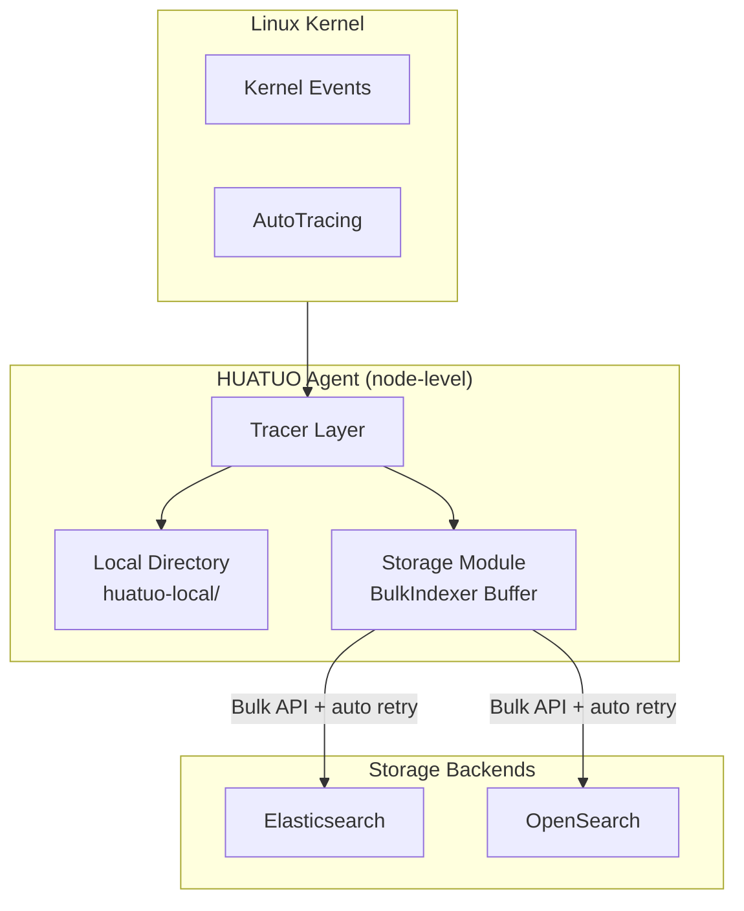
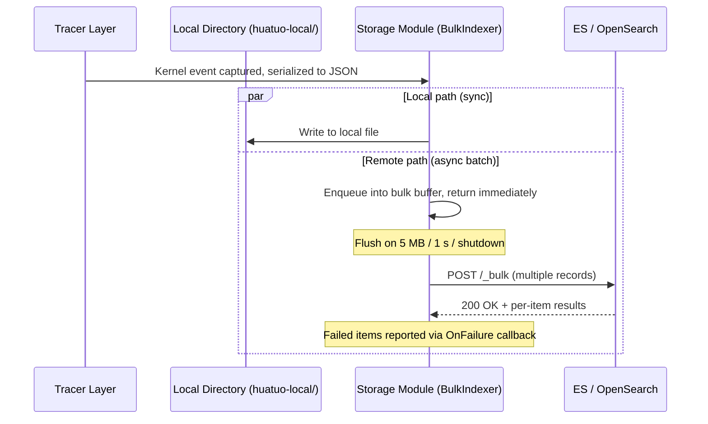

{}
<div style="text-align: center;">
HUATUO is an open-source OS-level deep observability project initiated by DiDi and incubated by the CCF (China Computer Federation). It provides kernel-level observability for cloud-native computing, AI computing, cloud services, and foundational infrastructure.
</div>
{}

## 📖 Overview

HUATUO supports persisting Linux kernel events collected by the Tracer and AutoTracing data to external storage backends. Both Elasticsearch and OpenSearch are supported.

After serialization to JSON, collected events are written concurrently to the local node directory (`huatuo-local/`) and the configured remote storage backend. The local directory retains a local copy of events; the remote backend provides durable storage and structured query capabilities.

This document covers configuration and verification for both Elasticsearch and OpenSearch. Examples use Docker deployments. In production, replace the addresses with your actual service endpoints — the configuration format is the same.

---

## 🎯 Use Cases

### Kubernetes Cloud-Native Fault Tracing

In containerized environments, kernel events such as Pod OOM and node Hung Task are transient — logs are often purged shortly after the event occurs. By writing events to Elasticsearch or OpenSearch, operations teams can query the historical timeline of anomalies by time range and precisely identify the root cause of intermittent failures during post-incident reviews.

### AI Compute Cluster Stability Auditing

During long-running GPU training workloads, the historical distribution of events such as `ras` hardware errors and `iotracing` I/O latency is critical for capacity planning and hardware health assessment. Persisting collected data enables aggregate queries to establish node stability baselines and supports proactive maintenance decisions.

### Compliance and Event Retention

Security compliance standards require that system anomaly events be traceable. Writing HUATUO-captured kernel events to OpenSearch and configuring an index lifecycle policy satisfies compliance requirements for event retention periods and query capabilities.

### Observability Platform Integration

Both Elasticsearch and OpenSearch provide native data source integrations with Grafana. Once HUATUO events are written to storage, you can build kernel event trend dashboards in Grafana, overlaid with application-layer metrics for historical analysis and alert review.

---

## 💎 Value

| Dimension | Local Storage Only | With External Storage Backend |
|---|---|---|
| Data Durability | Limited by node disk capacity; may be lost on restart | Persisted to distributed storage; supports long-term retention |
| Query Capability | No structured queries; relies on file search | Full-text search, field filtering, time-range aggregation |
| Visualization | Not supported | Direct integration with Grafana, Kibana, and similar platforms |
| Multi-node Aggregation | Data scattered across individual nodes | Centralized storage; supports cross-node queries |
| Compliance Retention | Difficult to meet retention requirements | Configurable index lifecycle policies; meets compliance retention requirements |

---

## 🚀 Usage

### OpenSearch V2

#### 1. Deploy OpenSearch

```bash
docker pull opensearchproject/opensearch:2.6.0
docker run -d --name opensearch --network host \
  -e "discovery.type=single-node" \
  opensearchproject/opensearch:2.6.0
```

#### 2. Verify Service Status

```bash
curl -k -u admin:admin https://localhost:9200
```

Example response:

```json
{
  "name" : "22ca72df78c0",
  "cluster_name" : "docker-cluster",
  "cluster_uuid" : "yxb3foceQVKzXXO6bHpPHQ",
  "version" : {
    "distribution" : "opensearch",
    "number" : "2.6.0",
    "build_type" : "tar",
    "build_hash" : "7203a5af21a8a009aece1474446b437a3c674db6",
    "build_date" : "2023-02-24T18:57:04.388618985Z",
    "build_snapshot" : false,
    "lucene_version" : "9.5.0",
    "minimum_wire_compatibility_version" : "7.10.0",
    "minimum_index_compatibility_version" : "7.0.0"
  },
  "tagline" : "The OpenSearch Project: https://opensearch.org/"
}
```

If verification fails, check the container logs:

```bash
docker logs opensearch
```

#### 3. Configure huatuo-bamai

Add the following configuration to `huatuo-bamai.conf`. The default username and password for the OpenSearch container image are both `admin`. For a full description of storage configuration options, refer to the Configuration Guide.

```toml
[Storage.ES]
    Address = "https://127.0.0.1:9200"
    Index = "huatuo_bamai"
    # CAFile = "/path/to/ca.crt"
    # CertFile = "/path/to/client.crt"
    # KeyFile = "/path/to/client.key"
    # InsecureSkipVerify = false
    Username = "admin"
    Password = "admin"
```

#### 4. Start huatuo-bamai

Use `--config-dir` to specify the directory containing the configuration file:

```bash
./_output/bin/huatuo-bamai --region dev --config-dir .
```

When files (e.g., `net_rx_latency`) appear in the local storage directory `huatuo-local/`, kernel events have been successfully captured. Query data from OpenSearch with:

```bash
curl -k -u admin:admin \
  -X GET "https://localhost:9200/huatuo_bamai/_search?pretty" \
  -H "Content-Type: application/json" \
  -d '{"query": {"match_all": {}}}'
```

Example response:

```json
{
    "_index" : "huatuo_bamai",
    "_id" : "yjPG_50Bu_OF-hukxKR7",
    "_score" : 1.0,
    "_source" : {
      "hostname" : "hostname",
      "region" : "dev",
      "uploaded_time" : "2026-05-07T00:11:49.753166222Z",
      "time" : "2026-05-07 00:11:49.753 +0000",
      "tracer_name" : "net_rx_latency",
      "tracer_time" : "2026-05-07 00:11:49.753 +0000",
      "tracer_type" : "auto",
      "tracer_data" : {
        "comm" : "<nil>",
        "pid" : 0,
        "where" : "TO_NETIF_RCV",
        "latency_ms" : 1776078133565,
        "saddr" : "127.0.0.1",
        "daddr" : "127.0.0.1",
        "sport" : 37736,
        "dport" : 9200,
        "seq" : 1080592402,
        "ack_seq" : 2465063876,
        "pkt_len" : 781
      }
    }
}
```

To get the total document count without listing individual records:

```bash
curl -k -u admin:admin -X GET "https://localhost:9200/huatuo_bamai/_count?pretty"
```

Example response: the `count` value equals the total number of written records.

```json
{
  "count" : 2680,
  "_shards" : {
    "total" : 1,
    "successful" : 1,
    "skipped" : 0,
    "failed" : 0
  }
}
```

---

### Elasticsearch V8

#### 1. Deploy Elasticsearch

```bash
docker pull docker.elastic.co/elasticsearch/elasticsearch:8.15.5
docker run -d --name elasticsearch --network host \
  -e "discovery.type=single-node" \
  -e "ES_JAVA_OPTS=-Xms1g -Xmx1g" \
  -e "ELASTIC_PASSWORD=123456" \
  docker.elastic.co/elasticsearch/elasticsearch:8.15.5
```

#### 2. Verify Service Status

```bash
curl -k -u elastic:123456 https://localhost:9200
```

Example response:

```json
{
  "name" : "ab0b562f8dbd",
  "cluster_name" : "docker-cluster",
  "cluster_uuid" : "aVfOVgJTQXuhZ3HGotK3ww",
  "version" : {
    "number" : "8.15.5",
    "build_flavor" : "default",
    "build_type" : "docker",
    "build_hash" : "b10896bcfe167cce44a84ba2771d101fb596d40d",
    "build_date" : "2024-11-21T22:06:13.985834967Z",
    "build_snapshot" : false,
    "lucene_version" : "9.11.1",
    "minimum_wire_compatibility_version" : "7.17.0",
    "minimum_index_compatibility_version" : "7.0.0"
  },
  "tagline" : "You Know, for Search"
}
```

#### 3. Configure huatuo-bamai

Add the following configuration to `huatuo-bamai.conf`. The default username for the Elasticsearch container image is `elastic`; the password is set via the `ELASTIC_PASSWORD` environment variable. For a full description of storage configuration options, refer to the Configuration Guide.

```toml
[Storage.ES]
    Address = "https://127.0.0.1:9200"
    Index = "huatuo_bamai"
    # CAFile = "/path/to/ca.crt"
    # CertFile = "/path/to/client.crt"
    # KeyFile = "/path/to/client.key"
    # InsecureSkipVerify = false
    Username = "elastic"
    Password = "123456"
```

#### 4. Start huatuo-bamai

Use `--config-dir` to specify the directory containing the configuration file:

```bash
./_output/bin/huatuo-bamai --region dev --config-dir .
```

When files (e.g., `net_rx_latency`) appear in the local storage directory `huatuo-local/`, kernel events have been successfully captured. Query data from Elasticsearch with:

```bash
curl -k -u elastic:123456 \
  -X GET "https://localhost:9200/huatuo_bamai/_search?pretty" \
  -H "Content-Type: application/json" \
  -d '{"query": {"match_all": {}}}'
```

Example response:

```json
{
    "_index" : "huatuo_bamai",
    "_id" : "WtNZAJ4BQ8x-thPHEY1i",
    "_score" : 1.0,
    "_source" : {
      "hostname" : "hostname",
      "region" : "dev",
      "uploaded_time" : "2026-05-07T02:51:37.696263325Z",
      "time" : "2026-05-07 02:51:37.696 +0000",
      "tracer_name" : "net_rx_latency",
      "tracer_time" : "2026-05-07 02:51:37.696 +0000",
      "tracer_type" : "auto",
      "tracer_data" : {
        "comm" : "<nil>",
        "pid" : 0,
        "where" : "TO_NETIF_RCV",
        "latency_ms" : 1776078133565,
        "saddr" : "127.0.0.1",
        "daddr" : "127.0.0.1",
        "sport" : 2379,
        "dport" : 36706,
        "seq" : 950542706,
        "ack_seq" : 1960972383,
        "pkt_len" : 91
      }
    }
}
```

To get the total document count without listing individual records:

```bash
curl -k -u elastic:123456 -X GET "https://localhost:9200/huatuo_bamai/_count?pretty"
```

Example response: the `count` value equals the total number of written records.

```json
{
  "count" : 2680,
  "_shards" : {
    "total" : 1,
    "successful" : 1,
    "skipped" : 0,
    "failed" : 0
  }
}
```

### Elasticsearch V7

Elasticsearch V7 uses HTTP by default. Replace `https` with `http` in all commands.

#### 1. Deploy Elasticsearch

```bash
docker pull docker.elastic.co/elasticsearch/elasticsearch:7.10.1
docker run -d --name elasticsearch --network host \
  -e "discovery.type=single-node" \
  -e "ES_JAVA_OPTS=-Xms1g -Xmx1g" \
  -e "ELASTIC_PASSWORD=123456" \
  docker.elastic.co/elasticsearch/elasticsearch:7.10.1
```

#### 2. Verify Service Status

```bash
curl -k -u elastic:123456 http://localhost:9200
```

Example response:

```json
{
  "name" : "d88c9e8df48b",
  "cluster_name" : "docker-cluster",
  "cluster_uuid" : "_ZZefWx4SniAc255t_lIVg",
  "version" : {
    "number" : "7.10.1",
    "build_flavor" : "default",
    "build_type" : "docker",
    "build_hash" : "1c34507e66d7db1211f66f3513706fdf548736aa",
    "build_date" : "2020-12-05T01:00:33.671820Z",
    "build_snapshot" : false,
    "lucene_version" : "8.7.0",
    "minimum_wire_compatibility_version" : "6.8.0",
    "minimum_index_compatibility_version" : "6.0.0-beta1"
  },
  "tagline" : "You Know, for Search"
}
```

#### 3. Configure huatuo-bamai

```toml
[Storage.ES]
    Address = "http://127.0.0.1:9200"
    Index = "huatuo_bamai"
    Username = "elastic"
    Password = "123456"
```

#### 4. Start huatuo-bamai

Use `--config-dir` to specify the directory containing the configuration file:

```bash
./_output/bin/huatuo-bamai --region dev --config-dir .
```

When files (e.g., `net_rx_latency`) appear in the local storage directory `huatuo-local/`, kernel events have been successfully captured. Query data from Elasticsearch with:

```bash
curl -k -u elastic:123456 \
  -X GET "http://localhost:9200/huatuo_bamai/_search?pretty" \
  -H "Content-Type: application/json" \
  -d '{"query": {"match_all": {}}}'
```

To get the total document count:

```bash
curl -k -u elastic:123456 -X GET "http://localhost:9200/huatuo_bamai/_count?pretty"
```

---

## ⚙️ How It Works

### System Architecture

The HUATUO Storage module runs on each node. It writes kernel events captured by the Tracer to the local directory and to Elasticsearch or OpenSearch. Both backends share the same `[Storage.ES]` configuration interface and are differentiated by address.

The remote write path uses the ES/OpenSearch **Bulk API** (`_bulk`): events are queued in an in-memory buffer and submitted in batches by background workers based on size and time thresholds, with transport-layer retries on transient failures.



### Write Flow

`Save` returns immediately after the event is buffered. Background workers flush the buffer to the remote backend when **any** of the following triggers fire: byte threshold, time threshold, or process shutdown. The local directory write is synchronous and independent of the remote Bulk path.



### Bulk Write Mechanism

#### Buffering and Flush Triggers

| Parameter         | Value               | Meaning                                         |
|-------------------|---------------------|-------------------------------------------------|
| `FlushBytes`      | 5 MB                | Flush when accumulated bytes reach the threshold |
| `FlushInterval`   | 1 s                 | Force-flush 1 second after the previous flush    |
| `NumWorkers`      | 4                   | Concurrent workers submitting Bulk requests      |
| Process shutdown  | `Close(ctx)`        | SIGTERM/SIGINT triggers a 10 s bounded drain     |

#### Two-Tier Retry Policy

Bulk failures are split into two layers with different retry semantics:

| Layer                | Trigger                                                                       | Behavior                                                                                                  | Retried? |
|----------------------|-------------------------------------------------------------------------------|-----------------------------------------------------------------------------------------------------------|----------|
| **Whole-batch retry** | Transport error (connect / timeout / TLS)<br>HTTP status: `429 / 502 / 503 / 504` | Client retries with exponential backoff: 100 ms → 200 ms → 400 ms → 800 ms, up to **3 attempts**            | ✅ auto |
| **Whole-batch reject**| HTTP status: `400 / 401 / 403 / 404 / 413`, etc.                              | Not retried; all records in the batch are dropped, an error is logged via `OnError`                        | ❌ drop |
| **Per-item failure**  | 200 OK with per-item error: version conflict, mapping error, document too large| Not retried; only the failed item is dropped, `OnFailure` logs `index/id/status/type/reason`               | ❌ drop |
| **Per-item success**  | 200 OK with per-item success                                                  | Considered durably indexed                                                                                 | —        |

**Why this design**: 429/5xx and transport errors signal transient remote unavailability where retries are effective; 4xx (except 429) and per-item errors are client-side semantic issues (data shape, permissions) where retries would only amplify the failure — they should be surfaced via logs for human investigation.

#### Data-Loss Scenarios

In all three scenarios below, `Save` returns `nil` but the event never reaches the index:

1. **Abnormal process exit**: `SIGKILL` or host power loss drops whatever is still buffered in the BulkIndexer (the local directory still keeps a copy).
   - Mitigation: SIGTERM/SIGINT trigger graceful shutdown; `Close` force-flushes the buffer with a 10 s deadline.
2. **Whole-batch permanent rejection**: 4xx (non-429) errors discard every record in the batch. Common causes: disabled index, expired credentials, document exceeding the cluster's `http.max_content_length`.
   - Diagnosis: `OnError` log includes ES's `type` and `reason`.
3. **Permanent per-item failure**: mapping conflict, version conflict, malformed document.
   - Diagnosis: `OnFailure` log identifies the record by `index/id`.

> **The local directory is always a fallback**: even if remote writes are lost, events remain available in `huatuo-local/` as the eventual-consistency safety net.

#### Problems This Solves

Replacing per-event Index API calls with a buffered BulkIndexer + auto-retry addresses four classes of problems:

| Problem                                  | Old approach bottleneck                                 | Bulk approach improvement                                            |
|------------------------------------------|---------------------------------------------------------|----------------------------------------------------------------------|
| **TLS handshake CPU cost**               | One HTTPS handshake per event saturated CPU under FIPS/RSA-PSS | Many events share one connection and one handshake; TLS PSK tickets cached |
| **Remote RTT throughput ceiling**        | One round-trip per event capped node-level write rate    | One Bulk request carries up to 5 MB; throughput scales with batch size |
| **Transient remote jitter / 429 throttle** | A single failure dropped the event with no retry         | Client-level retry absorbs short-lived faults                         |
| **Decoupling tracer layer from backend** | Slow remote backed pressure into capture, delaying tracing | Async buffer decouples capture from network — capture is no longer blocked on remote latency |

---

## 🌟 Stay Connected

{}
<div style="text-align: center;">
🌟 Star us on GitHub: <a href="https://github.com/ccfos/huatuo" target="_blank">https://github.com/ccfos/huatuo</a>
<br><br>
👀 Follow our official WeChat public account<br>

</div>
{}
