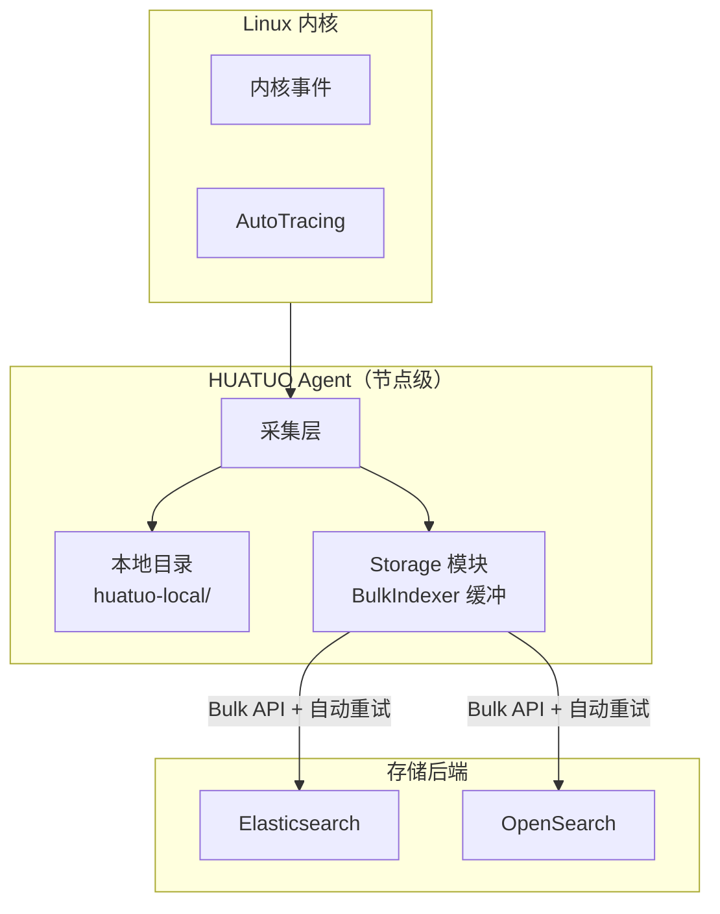
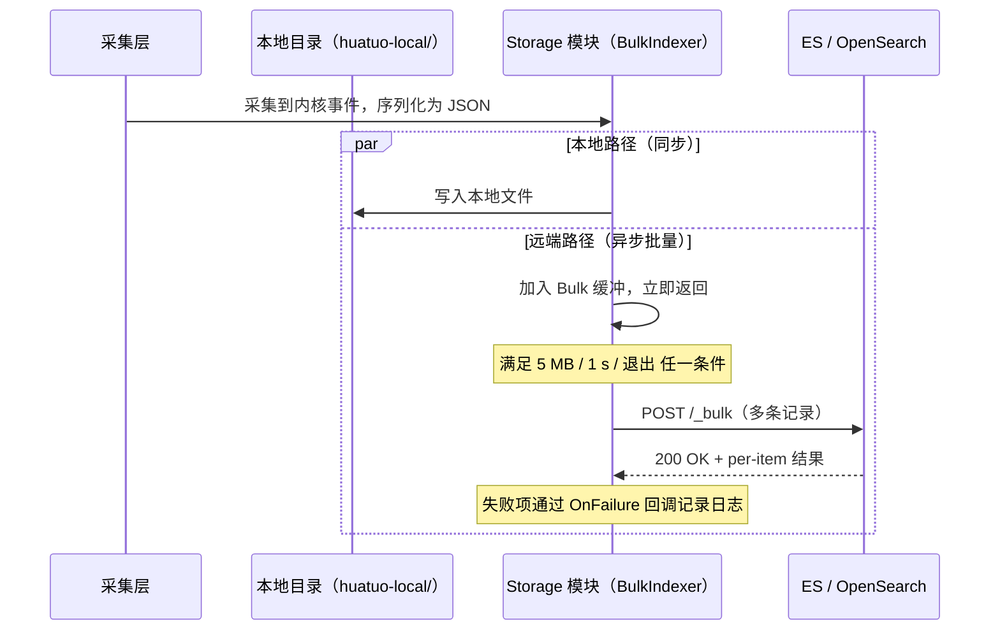

{}
<div style="text-align: center;">
HUATUO（华佗）是由滴滴开源并依托 CCF（中国计算机学会）孵化的操作系统深度观测项目，专注为云原生通用计算、AI 计算、云服务、基础服务等提供操作系统内核级深度观测能力。
</div>
{}

## 📖 概述

HUATUO（华佗）支持将采集到的 Linux 内核事件与 AutoTracing 数据持久化写入外部存储后端。当前支持 Elasticsearch 和 OpenSearch 两种存储系统。

采集到的事件在序列化为 JSON 后，同时写入节点本地目录（`huatuo-local/`）和配置的远端存储后端。本地目录保留事件的本地副本，远端存储提供持久化与结构化查询能力。

本文介绍 Elasticsearch 和 OpenSearch 的配置与验证方法。示例基于 Docker 部署，生产环境只需将地址替换为实际服务地址，配置方式一致。

---

## 🎯 应用场景

### Kubernetes 云原生故障溯源

容器化环境中，Pod OOM、节点 Hung Task 等内核事件具有短暂性，日志往往在事件发生后被清理。将事件写入 Elasticsearch 或 OpenSearch 后，运维团队可按时间范围查询历史异常时间线，在事后复盘阶段精确定位间歇性故障的根因。

### AI 计算集群稳定性审计

GPU 训练集群长期运行过程中，`ras` 硬件错误、`iotracing` I/O 延迟等事件的历史分布对容量规划和硬件健康评估至关重要。将采集数据持久化后，可通过聚合查询建立节点稳定性基线，为主动维护提供数据依据。

### 合规与事件留存

等保合规要求系统异常事件具备可追溯性。将 HUATUO 采集的内核事件写入 OpenSearch 并配置索引生命周期策略，可满足对事件留存周期和查询能力的合规要求。

### 可观测性平台集成

Elasticsearch 和 OpenSearch 均提供与 Grafana 的原生数据源对接能力。将 HUATUO 事件写入存储后，可在 Grafana 中构建内核事件趋势面板，与应用层指标叠加展示，实现历史数据分析与告警回顾。

---

## 💎 价值

| 维度         | 仅本地存储                          | 接入外部存储后端                              |
|------------|-----------------------------------|----------------------------------------------|
| 数据持久性  | 受节点磁盘容量限制，重启后可能丢失    | 数据持久化至分布式存储，支持长期保留           |
| 查询能力    | 无结构化查询，依赖文件搜索            | 支持全文检索、字段过滤、时间范围聚合           |
| 可视化集成  | 不支持                              | 可直接对接 Grafana、Kibana 等可视化平台        |
| 多节点汇聚  | 数据分散在各节点本地                  | 集中写入统一存储，支持跨节点查询               |
| 合规留存    | 难以满足留存周期要求                  | 可配置索引生命周期策略，满足合规留存要求       |

---

## 🚀 使用

### OpenSearch V2

#### 1. 部署 OpenSearch

```bash
docker pull opensearchproject/opensearch:2.6.0
docker run -d --name opensearch --network host \
    -e "discovery.type=single-node" \
    opensearchproject/opensearch:2.6.0
```

#### 2. 验证服务状态

```bash
curl -k -u admin:admin https://localhost:9200
```

返回示例：

```json
{
  "name" : "22ca72df78c0",
  "cluster_name" : "docker-cluster",
  "cluster_uuid" : "yxb3foceQVKzXXO6bHpPHQ",
  "version" : {
    "distribution" : "opensearch",
    "number" : "2.6.0",
    "build_type" : "tar",
    "build_hash" : "7203a5af21a8a009aece1474446b437a3c674db6",
    "build_date" : "2023-02-24T18:57:04.388618985Z",
    "build_snapshot" : false,
    "lucene_version" : "9.5.0",
    "minimum_wire_compatibility_version" : "7.10.0",
    "minimum_index_compatibility_version" : "7.0.0"
  },
  "tagline" : "The OpenSearch Project: https://opensearch.org/"
}
```

若验证失败，可通过以下命令查看容器日志：

```bash
docker logs opensearch
```

#### 3. 配置 huatuo-bamai

在 `huatuo-bamai.conf` 中添加以下配置。OpenSearch 容器镜像默认用户名和密码均为 `admin`。存储配置的详细说明请参见[配置指南](/docs/configuration/huatuo-bamai-configuration_zh.md)。

```toml
[Storage.Elasticsearch]
    Address = "https://127.0.0.1:9200"
    Index = "huatuo_bamai"
    Username = "admin"
    Password = "admin"
```

#### 4. 启动 huatuo-bamai

通过 `--config-dir` 指定配置文件所在目录：

```bash
./_output/bin/huatuo-bamai --region dev --config-dir .
```

当本地存储目录 `huatuo-local/` 中生成文件（例如 `net_rx_latency`）时，说明已成功采集到内核事件。可使用以下命令从 OpenSearch 查询数据：

```bash
curl -k -u admin:admin \
    -X GET "https://localhost:9200/huatuo_bamai/_search?pretty" \
    -H "Content-Type: application/json" \
    -d '{"query": {"match_all": {}}}'
```

返回示例：

```json
{
    "_index" : "huatuo_bamai",
    "_id" : "yjPG_50Bu_OF-hukxKR7",
    "_score" : 1.0,
    "_source" : {
      "hostname" : "hostname",
      "region" : "dev",
      "uploaded_timestamp" : "2026-05-07T00:11:49.753166222Z",
      "tracer_name" : "net_rx_latency",
      "observed_timestamp" : "2026-05-07T00:11:49.753166222Z",
      "tracer_type" : "event",
      "tracer_data" : {
        "comm" : "<nil>",
        "pid" : 0,
        "latency_stage" : "RX_STAGE_NETIF",
        "latency_ms" : 1776078133565,
        "tcp_saddr" : "127.0.0.1",
        "tcp_daddr" : "127.0.0.1",
        "tcp_sport" : 37736,
        "tcp_dport" : 9200,
        "tcp_seq" : 1080592402,
        "tcp_ack_seq" : 2465063876,
        "packet_len_bytes" : 781
      }
    }
}
```

查看文档记录总数，不查看具体列表。

```bash
curl -k -u admin:admin -X GET "https://localhost:9200/huatuo_bamai/_count?pretty"
```

返回示例：其中 count 数字 = 写入记录的总数。
```json
{
  "count" : 2680,
  "_shards" : {
    "total" : 1,
    "successful" : 1,
    "skipped" : 0,
    "failed" : 0
  }
}
```

---

### Elasticsearch V8

#### 1. 部署 Elasticsearch

```bash
docker pull docker.elastic.co/elasticsearch/elasticsearch:8.15.5
docker run -d --name elasticsearch --network host \
    -e "discovery.type=single-node" \
    -e "ES_JAVA_OPTS=-Xms1g -Xmx1g" \
    -e "ELASTIC_PASSWORD=123456" \
    docker.elastic.co/elasticsearch/elasticsearch:8.15.5
```

#### 2. 验证服务状态

```bash
curl -k -u elastic:123456 https://localhost:9200
```

返回示例：

```json
{
  "name" : "ab0b562f8dbd",
  "cluster_name" : "docker-cluster",
  "cluster_uuid" : "aVfOVgJTQXuhZ3HGotK3ww",
  "version" : {
    "number" : "8.15.5",
    "build_flavor" : "default",
    "build_type" : "docker",
    "build_hash" : "b10896bcfe167cce44a84ba2771d101fb596d40d",
    "build_date" : "2024-11-21T22:06:13.985834967Z",
    "build_snapshot" : false,
    "lucene_version" : "9.11.1",
    "minimum_wire_compatibility_version" : "7.17.0",
    "minimum_index_compatibility_version" : "7.0.0"
  },
  "tagline" : "You Know, for Search"
}
```

#### 3. 配置 huatuo-bamai

在 `huatuo-bamai.conf` 中添加以下配置。Elasticsearch 容器镜像默认用户名为 `elastic`，密码通过环境变量 `ELASTIC_PASSWORD` 设置。存储配置的详细说明请参见[配置指南](/docs/configuration/huatuo-bamai-configuration_zh.md)。

```toml
[Storage.Elasticsearch]
    Address = "https://127.0.0.1:9200"
    Index = "huatuo_bamai"
    Username = "elastic"
    Password = "123456"
```

#### 4. 启动 huatuo-bamai

通过 `--config-dir` 指定配置文件所在目录：

```bash
./_output/bin/huatuo-bamai --region dev --config-dir .
```

当本地存储目录 `huatuo-local/` 中生成文件（例如 `net_rx_latency`）时，说明已成功采集到内核事件。可使用以下命令从 Elasticsearch 查询数据：

```bash
curl -k -u elastic:123456 \
    -X GET "https://localhost:9200/huatuo_bamai/_search?pretty" \
    -H "Content-Type: application/json" \
    -d '{"query": {"match_all": {}}}'
```

返回示例：

```json
{
    "_index" : "huatuo_bamai",
    "_id" : "WtNZAJ4BQ8x-thPHEY1i",
    "_score" : 1.0,
    "_source" : {
      "hostname" : "hostname",
      "region" : "dev",
      "uploaded_timestamp" : "2026-05-07T02:51:37.696263325Z",
      "tracer_name" : "net_rx_latency",
      "observed_timestamp" : "2026-05-07T02:51:37.696263325Z",
      "tracer_type" : "event",
      "tracer_data" : {
        "comm" : "<nil>",
        "pid" : 0,
        "latency_stage" : "RX_STAGE_NETIF",
        "latency_ms" : 1776078133565,
        "tcp_saddr" : "127.0.0.1",
        "tcp_daddr" : "127.0.0.1",
        "tcp_sport" : 2379,
        "tcp_dport" : 36706,
        "tcp_seq" : 950542706,
        "tcp_ack_seq" : 1960972383,
        "packet_len_bytes" : 91
      }
    }
}
```

查看文档记录总数，不查看具体列表。

```bash
curl -k -u elastic:123456 -X GET "https://localhost:9200/huatuo_bamai/_count?pretty"
```

返回示例：其中 count 数字 = 写入记录的总数。
```json
{
  "count" : 2680,
  "_shards" : {
    "total" : 1,
    "successful" : 1,
    "skipped" : 0,
    "failed" : 0
  }
}
```

### Elasticsearch V7

V7 默认使用 HTTP，因此只需要在访问服务时替换为 HTTP 即可。

#### 1. 部署 Elasticsearch

```bash
docker pull docker.elastic.co/elasticsearch/elasticsearch:7.10.1
docker run -d --name elasticsearch --network host \
    -e "discovery.type=single-node" \
    -e "ES_JAVA_OPTS=-Xms1g -Xmx1g" \
    -e "ELASTIC_PASSWORD=123456" \
    docker.elastic.co/elasticsearch/elasticsearch:7.10.1
```

#### 2. 验证服务状态

```bash
curl -k -u elastic:123456 http://localhost:9200
```

返回示例：

```json
{
  "name" : "d88c9e8df48b",
  "cluster_name" : "docker-cluster",
  "cluster_uuid" : "_ZZefWx4SniAc255t_lIVg",
  "version" : {
    "number" : "7.10.1",
    "build_flavor" : "default",
    "build_type" : "docker",
    "build_hash" : "1c34507e66d7db1211f66f3513706fdf548736aa",
    "build_date" : "2020-12-05T01:00:33.671820Z",
    "build_snapshot" : false,
    "lucene_version" : "8.7.0",
    "minimum_wire_compatibility_version" : "6.8.0",
    "minimum_index_compatibility_version" : "6.0.0-beta1"
  },
  "tagline" : "You Know, for Search"
}
```

#### 3. 配置 huatuo-bamai

```toml
[Storage.Elasticsearch]
    Address = "http://127.0.0.1:9200"
    Index = "huatuo_bamai"
    Username = "elastic"
    Password = "123456"
```

#### 4. 启动 huatuo-bamai

通过 `--config-dir` 指定配置文件所在目录：

```bash
./_output/bin/huatuo-bamai --region dev --config-dir .
```

当本地存储目录 `huatuo-local/` 中生成文件（例如 `net_rx_latency`）时，说明已成功采集到内核事件。可使用以下命令从 Elasticsearch 查询数据：

```bash
curl -k -u elastic:123456 \
    -X GET "http://localhost:9200/huatuo_bamai/_search?pretty" \
    -H "Content-Type: application/json" \
    -d '{"query": {"match_all": {}}}'

或者：
curl -k -u elastic:123456 \
    -X GET "http://localhost:9200/huatuo_bamai/_count?pretty"
```

---

## ⚙️ 原理

### 系统架构

HUATUO Storage 模块部署在节点上，将采集到的内核事件同时写入本地目录和 Elasticsearch 或 OpenSearch。两种存储后端共用同一套 `[Storage.Elasticsearch]` 配置接口，通过地址区分。

写入远端时使用 ES/OpenSearch 的 **Bulk API**（`_bulk`）：事件先进入节点内的批量缓冲，由后台 worker 按"大小或时间"的阈值聚合后一次提交多条记录，并在传输层失败时按策略自动重试。



### 过滤条件语义

内部存储查询 API 使用 AND 组合过滤条件。SQLite 和 Elasticsearch 对非 null
标量值采用以下约定：

| 操作符 | 含义 |
| --- | --- |
| `OpEq`、`OpNe` | 相等／不等；缺失和 null 值均不匹配 |
| `OpGt`、`OpGte`、`OpLt`、`OpLte` | 严格／包含边界的范围比较 |
| `OpIn` | 属于非空切片或数组中的标量值 |
| `OpExists`、`OpNotExists` | 存在／不存在非 null 的可查询值；不设置 `Value` |

空字符串是字面值：`OpEq("")` 匹配空字符串；`OpNe("")` 要求字符串存在、非 null
且非空。查询缺失字段应使用 `OpNotExists`，`OpEq("")` 不再表示字段缺失。
主机 profiling 查询改用 `container_hostname` 的 `OpNotExists`，保留原有筛选行为。

比较值支持 Go 内建字符串、布尔、整数及有限浮点数，范围比较不接受布尔值。
`time.Time` 和 `timeutil.Timestamp` 统一转为保留九位小数的 UTC 字符串，
`OpIn` 元素也采用相同规则。nil、指针、对象、嵌套集合及非有限数值返回
`driver.ErrInvalidQuery`。整数范围边界保留原始 JSON 精度，实际支持的数值范围
仍受后端和字段映射约束。

Elasticsearch 调用方必须指定实际用于精确比较的索引字段：`keyword` 映射使用
原字段；`text` 映射使用明确配置的 keyword 子字段，例如 `hostname.keyword`。
后端不会猜测子字段，也不会将 text 与 keyword 查询进行 OR 组合。
`OpNe` 对同一字段执行 `exists` 和 `must_not term`。全文匹配和数组整体相等
不属于这里的标量比较约定。

Elasticsearch 的存在性判断针对索引值，而不是 `_source` 中是否包含键。
`ignore_above`、`null_value` 和 normalizer 等映射设置可能改变存在性或相等行为。
要求与 SQLite 一致时，应使用保留目标标量语义的映射。日期字段不能与空字符串
比较；表达“已有日期值”时应使用存在性操作符。

### 数据写入流程

采集层调用 `Save` 后立即返回，事件落入 BulkIndexer 缓冲；后台 worker 在满足"字节阈值 / 时间阈值 / 进程退出"任一条件时将批次提交至远端。本地目录写入是同步落盘，与远端 Bulk 路径相互独立。



### Bulk 批量写入机制

#### 缓冲与刷新

| 参数              | 值                  | 含义                            |
|-------------------|---------------------|---------------------------------|
| `FlushBytes`      | 5 MB                | 缓冲累计达到该字节数立即刷新     |
| `FlushInterval`   | 1 s                 | 距上次刷新满 1 秒后强制刷新      |
| `NumWorkers`      | 4                   | 并发提交 Bulk 请求的后台 goroutine 数 |
| 进程退出          | `Close(ctx)`        | SIGTERM/SIGINT 触发，限时 10 s 内排空缓冲 |

#### 两级重试策略

Bulk 请求的失败语义分为两层，重试范围不同：

| 层级           | 触发条件                                            | 处理方式                                                                                              | 是否重试 |
|----------------|-----------------------------------------------------|-------------------------------------------------------------------------------------------------------|----------|
| **整批失败**   | 传输错误（连接失败、超时、TLS）<br>HTTP 状态：`429 / 502 / 503 / 504` | 客户端按指数退避自动重试：100 ms → 200 ms → 400 ms → 800 ms，最多 **3 次**                              | ✅ 自动 |
| **整批拒绝**   | HTTP 状态：`400 / 401 / 403 / 404 / 413` 等          | 不重试，整批所有记录全部丢弃，并通过 `OnError` 写错误日志                                              | ❌ 丢弃 |
| **单条失败**   | 200 OK 但 per-item 失败：版本冲突、字段映射错误、文档过大 | 不重试，仅该单条丢弃，通过 `OnFailure` 回调记录 `index/id/status/type/reason`                          | ❌ 丢弃 |
| **单条成功**   | 200 OK 且 per-item 成功                              | 主分片写入成功；副本失败时记录包含索引、文档 ID 和失败分片数的警告日志                                    | —        |

**为什么这样设计**：429/5xx 与传输错误是远端短暂不可用的信号，重试有效；4xx（除 429）与 per-item 错误是客户端语义问题（数据格式、权限），重试只会放大错误，应交给开发与运维侧排查日志后修正。

### 分批读取

`Query(ctx, query, consume)` 按顺序同步调用回调，每批至少一条记录。`Limit` 是跳过
`Offset` 条匹配记录后交给回调的总条数上限。`storage.Store.Query` 统一校验 Limit
必须大于零、Offset 和 BatchSize 非负；后端只消费已校验的参数。
`BatchSize` 控制每批条数，零使用统一默认值 100，每批不超过剩余总限额。
需要数据的调用方必须明确传入正数总上限。`Count` 和 `Values` 只使用查询中的
`Filters`，忽略 `Sorts`、`Limit`、`Offset` 和 `BatchSize`，包括零值及负数分页参数。
`Count` 统计全部匹配记录；`Values` 使用独立的 `size` 参数，由 `storage.Store.Values`
在调用后端前校验其非负约束，后端不再重复校验这两个操作的分页参数或 `size`。
本地文件存储仍不支持查询。

SQLite 使用一条带 `LIMIT/OFFSET` 的 SELECT 逐行读取。回调期间查询占用唯一数据库
连接，不能同步再次访问同一后端。任务恢复按 ID 升序每批读取 1000 个 Job，读取关闭后
再启动监督任务，通过 ID 游标继续查询，避免任务状态变化导致偏移分页漏读。
Elasticsearch 7/8 和 OpenSearch 统一使用 Scroll 快照，支持跨越结果窗口的读取和偏移。
深偏移仍需读取并跳过前面的记录，不同 API 请求不共享快照。

各批次独立持有数据。回调、解码、后端错误或取消都会立即终止查询，已执行回调的效果
不会回滚。Scroll 使用独立的有界上下文清理，即使原查询已取消也会尝试释放资源。
查询不自动重试，因为丢失响应时 Scroll 游标可能已经前进；写入重试策略保持不变。

API 仅在未传 `limit` 时填默认值：Job 列表默认 100、最大 1000；原始 Profile 每页默认
20、最大 100，并保留 64 MiB 响应限制。显式零值、负数或超过上限的 limit 返回参数
错误。每页额外读取一条判断 `has_more`。

火焰图边读取边合并 Profile，每次查询总上限为 100000 个窗口。额外读取一条检测超限，
超限时返回错误，提示缩小时间范围或过滤条件；读取或合并失败都不返回部分火焰图。
输入批次可随处理进度释放，但合并结果的内存仍随不同调用栈数量增长。

#### 响应错误

HTTP 成功不代表结果完整。`Query` 和 `Values` 在搜索超时或分片失败时返回错误，
`Query` 不交付失败批次，但此前已消费的批次不会回滚；`Values` 不返回部分结果。
`Count` 在分片失败时返回零和错误。搜索超时优先于分片失败返回。
分片错误包含失败分片总数，以及首条失败的类型、原因及嵌套原因（如果存在）。

收到成功 HTTP 响应后，`DeleteByQuery` 按超时、执行失败的顺序检查，
遇到首个错误即返回，同时保留响应中的已删除数量。
索引不存在时返回零且不报错，其他 HTTP 错误返回零和错误。
已完成的删除不会回滚。
直接写入和删除在副本失败时保留主分片操作成功的语义，
通过警告日志记录可用的失败详情。Bulk 写入也会报告副本失败，不重试已经成功的主分片写入。

HTTP 错误包含响应状态码和可用的 Elasticsearch 错误详情。无法识别或过大的错误响应体
以原文报告，限制为 4 KiB，并在截断时追加标记。

#### 数据丢失场景

下列三种情况下，调用方调用 `Save` 时返回 `nil`，但事件最终未进入索引：

1. **进程异常退出**：`SIGKILL` 或宿主机断电时，BulkIndexer 内存缓冲尚未刷新的部分直接丢失（仅本地目录保留副本）。
   - 缓解：SIGTERM/SIGINT 走优雅退出路径，shutdown 时调用 `Close` 强制 flush，最长等待 10 秒。
2. **整批被永久拒绝**：4xx（非 429）类错误一次性丢弃整批所有记录。常见诱因：索引被禁用、密码失效、单条文档超过集群 `http.max_content_length`。
   - 排查：`OnError` 错误日志包含 ES 返回的 `type` 与 `reason`。
3. **单条永久失败**：mapping 冲突、版本冲突、文档语法错误。
   - 排查：`OnFailure` 错误日志按 `index/id` 定位失败记录。

> **本地目录始终保留副本**：即使远端写入丢失，事件仍可从 `huatuo-local/` 中找回，作为最终一致性的兜底。

#### 解决的问题

将"逐事件 Index API"换成"BulkIndexer 批量 + 自动重试"主要解决以下四类问题：

| 问题                              | 旧方案瓶颈                                  | Bulk 方案的改进                                       |
|-----------------------------------|---------------------------------------------|-------------------------------------------------------|
| **TLS 握手 CPU 开销**             | 每事件一次 HTTPS，握手在 FIPS / RSA-PSS 下占满 CPU | 多条事件复用单连接 + 单次握手；TLS PSK ticket 缓存复用 |
| **远端 RTT 与吞吐**               | 每事件一次往返，节点级写入受 RTT 限制        | 单次 Bulk 请求最多 5 MB，吞吐随批大小线性提升          |
| **远端短暂抖动 / 限流（429）**    | 单次失败立即丢弃，无重试                    | 客户端层面自动重试，吸收瞬态故障                       |
| **采集层对存储后端解耦**          | 远端慢会回压采集，影响内核事件采集时延       | 异步缓冲将采集与远端写入解耦，采集路径不被网络阻塞     |

---

## 🌟 结尾

{}
<div style="text-align: center;">
🌟 欢迎 Star: <a href="https://github.com/ccfos/huatuo" target="_blank">https://github.com/ccfos/huatuo</a>
<br><br>
👀 欢迎订阅官方微信公众号<br>

</div>
{}

### 内核观测时间

事件文档可包含顶层 `kernel_observed_timestamp`，其值为 UTC 日期时间。
`observed_timestamp` 是用户态观测时刻，`uploaded_timestamp` 是存储写入时刻。
三者不互相补填。旧文档及没有内核时间的事件省略新增字段；历史数据不自动迁移。
原始 `kernel_observed_ns` 仅用于进程内事件关联，不写入新文档。
