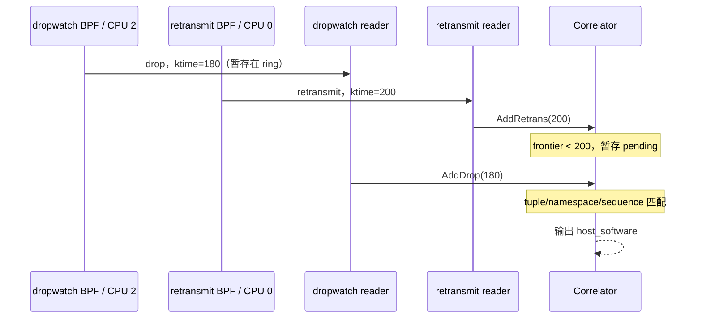
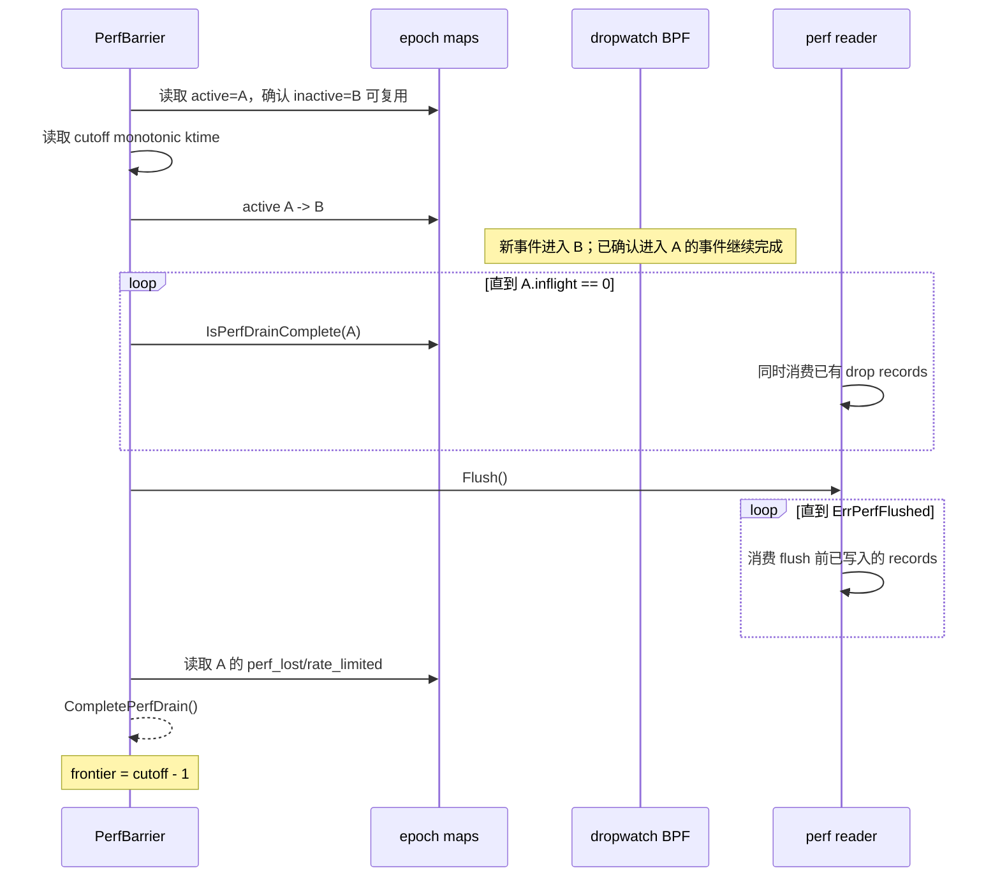

本文说明 PR #553 中 local correlation 的问题边界、当前实现和剩余限制。
重点不是介绍命令行用法，而是解释为什么两个看似都有四元组和时间戳的
事件，仍然不能直接进行一对一关联。

## 1. 结论

TCP 重传事件和 dropwatch 事件是两个独立的观测流。它们没有共同事件 ID，
也没有稳定、跨内核版本可用的 socket ID。关联只能依据以下证据推断：

- 同一网络命名空间；
- 相同或相反方向的四元组；
- 内核单调时间顺序；
- TCP sequence range 或反向 ACK；
- dropwatch 输入已经排空到重传事件的时间点；
- 观察区间内没有 perf 丢失、限速丢弃或 matcher 淘汰。

因此当前结果具有不同的证据强度：

| 结果 | 含义 |
| --- | --- |
| `host_software` | 找到了满足严格规则的 host dropwatch 正向证据。 |
| `unknown` | 没有严格正向匹配。`correlation_reasons` 说明启动历史、观察范围、输入完整性或匹配字段为何不足。 |

local correlation 不试图恢复完整 TCP 因果链，也不把任意同四元组 drop
都认定为重传原因。

## 2. 两条事件流观察的不是同一时刻

embedded dropwatch 观察的是 skb 被内核软件路径释放的时刻；TCP retransmit
观察的是内核稍后决定再次发送某个 sequence range 的时刻。
引发重传的证据可能是：

1. 出方向原始 segment 在 host 中被丢弃；
2. segment 已到达对端，但反方向 ACK 在本机被丢弃；
3. host 内没有可见 drop，问题位于 NIC、链路、远端或其他未观测位置；
4. 并非真实丢包，例如乱序、TLP 或当前规则不支持的 TCP 行为。

所以正向匹配要求 drop 的内核时间不晚于 retransmit：

```text
drop.ktime_ns <= retransmit.ktime_ns
```

用户态的 `observed_timestamp` 不能用于这个判断。它是事件被读取和格式化时
生成的墙上时间，会受到调度、perf 缓冲和系统时间调整影响。两侧必须使用
同一主机上的内核单调时间 `ktime_ns`。

## 3. 内核时间有序，不代表用户态到达有序

dropwatch 和 TCP retransmit 使用不同的 perf reader；perf event array
又按 CPU 保存数据。跨 reader、跨 CPU 不存在一个天然的全局读取顺序。

例如：

```text
CPU 2: drop       ktime=180，记录暂留在 dropwatch perf ring
CPU 0: retransmit ktime=200，先被 retransmit reader 读到
用户态: retransmit(200) 先到，drop(180) 后到
```

如果看到 retransmit 时立即输出 no-match，就会把随后到达的 drop 证据漏掉。
当前 correlator 因此把尚未被 dropwatch frontier 覆盖的 retransmit 放入
`pending`，允许时间更早但读取更晚的 drop 继续匹配。



输出层的互斥锁只能防止两个 goroutine 同时写 sink，不能把最终输出重新排序
为严格的 `ktime_ns` 顺序。

## 4. “没有匹配”比“找到匹配”更难证明

找到一个严格匹配的 drop 是正向证据；暂时没找到 drop 不是负向证据，原因
可能只是事件仍在 BPF、perf ring 或 reader 中。

以下状态决定 no-match 的 `correlation_reasons`：

- retransmit 的 `ktime_ns` 非零；
- retransmit 不早于 embedded dropwatch 的 ready boundary；
- dropwatch 的 `drained_through_ktime_ns` 已覆盖 retransmit；
- retransmit 类型具有当前规则支持的 sequence range；
- matcher 从未因容量不足淘汰 drop 证据；
- 累计 `perf_lost == 0`；
- 累计 `rate_limited == 0`。

当前实现对所有 no-match 都输出 `unknown`。即使 frontier 和 counters 健康，
启动前的 causal lookback 仍不完整，因此不能把“没有严格匹配”写成“host 中
没有发生软件丢包”。

需要注意：这些条件能证明 perf delivery 已完整，尚不能证明导致重传的整个
因果时间窗口都被观察。启动后的 causal lookback 是当前仍未解决的时序缺口，
见下一节。

### 4.1 Ready boundary

`readyFromKtimeNS` 在 embedded dropwatch BPF attach 成功后读取。它表示从哪个
内核时间点开始，dropwatch source 才具备提供新证据的能力。

TCP retransmit reader 可能已经捕获到更早的事件。例如 dropwatch 在
`ktime=100` 才 ready，而 retransmit 的 `ktime=90`。即使后来 frontier 到达
300，也不能排除 90 之前或附近发生过一个未被该 source 观察到的 drop，
所以结果必须是 `unknown`。

但仅检查 `retransmit.ktime_ns >= readyFromKtimeNS` 仍不充分。重传发生在原始
发送之后，真正的 segment 或 ACK drop 可能早于 dropwatch ready：

```text
ktime=50   原始 segment 在 host 中被丢弃，dropwatch 尚未启动
ktime=100  embedded dropwatch ready
ktime=200  TCP retransmit 事件
ktime=300  dropwatch frontier 完成
```

retransmit 200 位于 `[100, 300]`，但导致它的 host drop 实际发生在 50，观察者
没有机会看到。因此当前结果保持 `unknown` 并包含
`startup_history_incomplete`。ready boundary 解决的是“不要等待 source 启动前
产生的 perf 记录”，没有解决“重传对原始发送存在向前追溯时间”这一因果问题。

要让启动后的 negative classification 严格成立，后续设计至少需要一种额外
约束：

- 在启动后的 warm-up 期间只允许正向匹配，no-match 一律为 `unknown`；
- 获取原始发送时间或可验证的 skb/connection generation，确认 causal evidence
  不早于 ready；
- 明确定义并验证一个有限的最大 lookback，再等待该窗口结束。

TCP RTO 会退避，连接也可能在 source 启动前已经运行，因此不能随意选择一个
很短的固定 warm-up 并称其为完整证明。

### 4.2 Drained frontier

若 ready boundary 为 100，frontier 为 300，则 `ktime=200` 的 retransmit
位于 delivery 已完整的范围 `[100, 300]`。这里“完整”只表示：完成 barrier
后，不会再有由当前 source 产生、时间不晚于 200 的旧 dropwatch 记录到达
reader；它不包含 100 之前可能发生的 causal drop。

frontier 不是“最后一条已看到事件的时间”。即使区间内一条 drop 都没有，
barrier 仍能建立 frontier；这正是 no-match 可以定型的基础。

## 5. 为什么需要 epoch、inflight 和 perf drain

只调用 reader flush 不够。flush 只能处理已经进入 perf ring 的记录，而一个
BPF 程序可能已经进入 drop hook、尚未执行到 `bpf_perf_event_output`。如果此时
宣布排空，稍后完成的 BPF 程序仍可能写入一个时间更早的 drop。

当前实现使用两个 epoch slot。epoch 切换发生在周期性 perf status 更新和最终
关闭排空时，不是每个 TCP retransmit 事件切换一次：

- perf status 周期：100 ms；
- drain 期间 reader poll 周期：10 ms；
- 关闭时额外执行一次 final drain。

每个通过 device 和 pcap filter、进入 dropwatch 关键区的 BPF drop 事件执行
以下操作：

1. 先执行 device 和 pcap filter；拒绝的事件直接返回，不接触 epoch map；
2. 读取 active epoch；
3. 增加该 epoch 的 `inflight`；
4. 再次检查 active epoch；
5. 若 epoch 已切换，则减少旧 slot 的 `inflight` 并重试；
6. 确认 slot 后读取 `event_ktime`，处理限速和 perf output；
7. 退出前减少 `inflight`。

这里的 `inflight` 只统计正在执行 dropwatch BPF 关键区的事件，不统计 TCP
retransmit 事件。active epoch 表示新 dropwatch 事件应该加入哪个批次；
`inflight[epoch]` 表示该批次还有多少 BPF 执行尚未完成。

一次 drain 的顺序如下：



frontier 使用 `cutoff - 1`，因为 cutoff 自身是切换前取得的边界。实现宁可少
声明 1 ns，也不把边界上的并发事件错误归入已排空范围。

两个 slot 能循环复用，但复用 inactive slot 前必须确认：

- `inflight == 0`；
- `perf_lost` 和 `rate_limited` 没有在 inactive 期间意外变化。

这使 epoch 切换既是批次边界，也是对 BPF/userspace 并发竞态的校验。

## 6. 匹配不能只看四元组

同一连接可以有多个 segment、ACK 和重传；四元组相同不代表事件之间存在
因果关系。当前 matcher 使用以下组合键和规则。

### 6.1 网络命名空间

容器中可能存在完全相同的 IP 和端口。匹配优先比较 net namespace cookie；
任一侧没有 cookie 时，才在双方 inode 都有效时比较 inode。没有可用 namespace
标识的事件不能进入严格匹配。

### 6.2 出方向 segment

drop 与 retransmit 必须具有相同方向的地址族和四元组，且 sequence range
重叠：

```text
drop     [drop.seq, drop.end)
retrans  [retrans.seq, retrans.end)
```

SYN 和 FIN 各占用一个 sequence number。GSO skb 的 raw capture 可能只包含
有限头部，因此 range 长度还需要结合逻辑 L3 packet length，而不能只看
抓取到的 raw bytes。

### 6.3 反方向 ACK

ACK drop 使用反向四元组匹配。数据重传要求 ACK 覆盖重传 range；SYN 和
SYN-ACK 使用更严格的 ACK、SYN flag 和 sequence 关系。

### 6.4 候选选择与消费

多个 drop 都满足条件时，选择 `ktime_ns` 最接近 retransmit 的一个；时间相同
时使用内部 ID 决定最新项。匹配成功的 drop 只消费一次，避免一条证据解释
多个无关重传。

当前 matcher 不使用 skb pointer 作为主键。原始发送 skb、drop skb 和重传
队列 skb 的生命周期及地址不稳定，SYN-ACK/TLP 事件也不一定提供 skb pointer。

## 7. 过滤范围必须一致

negative evidence 只有在两个输入观察同一流量范围时才有效。PR #553 将同一个
pcap filter 同时用于 retransmit BPF 和 embedded dropwatch BPF。

但两个输入的原始数据并不相同：

- dropwatch 拥有真实 skb，可选择 L2 或 L3 view；
- retransmit queue skb 可能没有可靠的网络头和 TCP 头；
- SYN-ACK 和 TLP 路径甚至没有可直接过滤的完整 skb。

因此 retransmit BPF 需要从 socket tuple、TCP sequence 和 flags 构造最小的
IPv4/IPv6 + TCP L3 packet，再调用共享 pcap L3 stub。这个合成 packet 只保证
当前支持字段的语义一致，不等同于线上原始 packet。依赖以下信息的 filter
可能无法做到两侧完全等价：

- Ethernet/VLAN 等 L2 字段；
- TCP options 或真实 payload；
- IPv6 extension headers；
- NAT、隧道或 hook 前后发生变化的 tuple；
- retransmit 事件中不可获得的 packet metadata。

方向性 filter 也容易漏掉反向 ACK。例如只允许正向 `dst port 443`，可能保留
segment retransmit，却排除反方向 ACK drop。此时即使 counters 健康，观察范围
也未必覆盖完整因果路径。

## 8. 丢样、限速和容量都是正确性条件

### 8.1 Dropwatch perf loss

`perf_lost` 由 dropwatch BPF 在 `bpf_perf_event_output` 失败时累计。只要累计值
非零，就无法知道丢失的是否正是目标 drop，因此之后的 no-match 都必须保持
`unknown`。它不描述 TCP retransmit perf stream；后者丢样意味着整个 retransmit
事件没有进入输出，而不是把一个已有事件错误分类。

### 8.2 Rate limit

限速发生在 filter 之后。`rate_limited` 非零表示观察范围内确实有 drop 被主动
丢弃；这些事件同样可能包含目标证据。因此 rate limit 不能只视为性能指标，
它会直接降低 negative classification 的可信度。

### 8.3 Matcher 与 pending 容量

当前容量是固定的：

| 状态 | 容量 | 满时行为 |
| --- | ---: | --- |
| 可匹配 drop | 4096 | 淘汰最旧 drop，并永久标记本 generation 发生过 eviction。 |
| 待定 retransmit | 1024 | 最旧 pending 立即以 unsealed `unknown` 输出。 |

一旦 matcher 淘汰过 drop，后续 no-match 会增加
`drop_evidence_evicted`，明确说明可能丢失了目标证据。

固定容量避免高流量下无限增长，但它按事件数而非时间窗口限制状态。目前没有
稳定的跨内核 socket identity，也没有严格的最大因果时间窗口；长连接、四元组
复用和 sequence wrap-around 仍需依靠 namespace、时间顺序和 sequence 规则共同
降低误匹配风险。

## 9. Packet 解析也可能损失证据

dropwatch 只保留固定长度 raw packet 数据，并在用户态解析 IPv4/IPv6/TCP。
普通 TCP、SYN/FIN 和常见 GSO 情况可以结合 `packet_len` 计算 sequence range，
但以下情况可能无法形成严格证据：

- raw header 被截断；
- IPv6 extension header 使 TCP 不再是直接 next header；
- 非 TCP、RST、ICMP 或当前不支持的 TCP flag 组合；
- TLP 缺少稳定的 end sequence；
- SACK/DSACK 因果规则尚未实现。

当前解析失败不会增加 `perf_lost`，因为 perf record 已经成功到达。这意味着
negative classification 还隐含一个前提：目标流量必须属于当前 parser 和 matcher
支持的 packet 形态。对复杂封装或扩展头流量，应把 no-match 视为较弱证据。

## 10. 启动和关闭本身也是时序协议

### 10.1 启动

当前顺序是先启动 retransmit 输入，再加载并 attach embedded dropwatch，最后
记录 ready boundary。因此 retransmit ring 中可能存在早于 ready boundary 的
事件。correlator 必须识别并直接将这类 no-match 保持为 `unknown`，不能等待一个
不可能由当前 dropwatch generation 产生的旧证据。

### 10.2 运行时

dropwatch source goroutine 每 100 ms 执行一次 drain，推进 frontier 并解析
pending；retransmit reader 则持续加入新事件。两条路径都可能产生最终结果，
因此 sink 写入需要串行化。

### 10.3 关闭

不能在收到取消后立刻 detach BPF 或关闭 reader，否则 ring 中的最后一批 drop
会丢失。local correlation 的关闭顺序是：

1. 通知 dropwatch source 执行 final drain；
2. 推进最后一个 perf status，定型已覆盖的 pending；
3. `EndDropwatchInput` 将仍未覆盖的 pending 以 `unknown` 输出；
4. 取消 source context；
5. detach BPF；
6. 关闭 reader 和 BPF object；
7. 上层最后关闭输出 sink。

关闭带独立超时。超时或 drain 失败时，剩余事件不能伪装成已完整覆盖的
no-match。PR#553 只保证 tcpshark 子进程自身的 final drain；toolstream 排空
和 storage 关闭顺序由独立的 daemon lifecycle 变更负责。

## 11. 当前容易被误读的限制

1. 所有 no-match 都是 `unknown`；`correlation_reasons` 描述不能形成正向匹配
   或完整负向证据的具体原因。
2. `host_software` 表示严格匹配到了 embedded dropwatch 的软件丢包证据。
   embedded loader 明确排除 devlink hardware trap section，不把硬件事件送入
   correlator。
3. NAT、隧道、encapsulation 或不同 hook 位置看到的 tuple 可能与 socket tuple
   不一致，从而产生 no-match。
4. 输出顺序是“结果定型顺序”，不是严格的内核时间顺序。
5. counters 是当前 BPF load 的累计值。发生一次 loss 或 rate limit 后，无法
   精确定位受影响的时间区间，当前 generation 后续 no-match 都会更保守。
6. matcher 只覆盖 data、SYN、SYN-ACK 的严格规则；RST、ICMP、SACK/DSACK 和
   TLP 等路径仍保持 `unknown`。

## 12. 关键代码位置

| 位置 | 职责 |
| --- | --- |
| `bpf/dropwatch.c:dropwatch_epoch_acquire` | 获取 active epoch，维护 dropwatch BPF `inflight`。 |
| `bpf/dropwatch.c:drop_event_commit` | 先执行 filter，再获取 epoch、记录 `ktime_ns`、执行 rate limit 并写入 perf。 |
| `internal/netcorrelate/perf_barrier.go:(*PerfBarrier).BeginPerfDrain` | 取得 cutoff 并切换 active epoch。 |
| `internal/netcorrelate/perf_barrier.go:(*PerfBarrier).IsPerfDrainComplete` | 等待 frozen epoch 的 BPF 执行全部退出。 |
| `internal/netcorrelate/perf_barrier.go:(*PerfBarrier).CompletePerfDrain` | 汇总 counters 并发布 drained frontier。 |
| `internal/netcorrelate/matcher.go:(*matcher).matchWithCoverage` | 按 namespace、方向、tuple、ktime 和 TCP sequence 选择 drop，并报告跨 netns 候选。 |
| `internal/netcorrelate/correlator.go:(*Correlator).AddRetrans` | 立即匹配、进入 pending 或输出 no-match。 |
| `internal/netcorrelate/correlator.go:(*Correlator).UpdatePerfStatus` | 推进 frontier 并定型已覆盖的 pending。 |
| `cmd/tcpshark/correlation.go:runLocalDropSource` | 周期性 drain，并在关闭时执行 final drain。 |
| `cmd/tcpshark/correlation.go:(*localCorrelation).close` | 执行一次性的关闭时序和资源回收。 |

## 13. 评审和测试时应验证什么

- 构造 drop 的 `ktime_ns` 早于 retransmit，但让 drop reader 更晚返回，仍能匹配。
- frontier 小于 retransmit 时不输出负向结论；覆盖后才定型。
- retransmit 早于 ready boundary 时始终为 `unknown`。
- 在 causal-window 方案确定前，验证“drop 早于 ready、retransmit 晚于 ready”
  保持 `unknown` 并包含 `startup_history_incomplete`。
- epoch 切换期间的 BPF 事件不会跨过 barrier 后迟到。
- `perf_lost`、`rate_limited` 或 matcher eviction 任一出现时，在 no-match
  结果中保留对应 `correlation_reasons`。
- 正向 segment 与反向 ACK 分别覆盖 IPv4、IPv6、SYN、SYN-ACK 和 sequence
  wrap-around。
- namespace 相同/不同、cookie 缺失后的 inode fallback 都有测试。
- pending 和 matcher 容量达到上限时，结果保持保守且内存有界。
- SIGTERM/取消后，tcpshark 在子进程退出前执行 final drain。toolstream 和
  storage 的跨组件关闭顺序在独立的 daemon lifecycle 变更中验证。
- 同一个 filter 在真实 drop skb 和 retransmit 合成 L3 packet 上产生一致 verdict。

这些测试共同验证的不是“两个 map 中能查到相同四元组”，而是：在并发、乱序、
丢样和关闭条件下，系统不会把不完整观察错误解释成确定根因。
