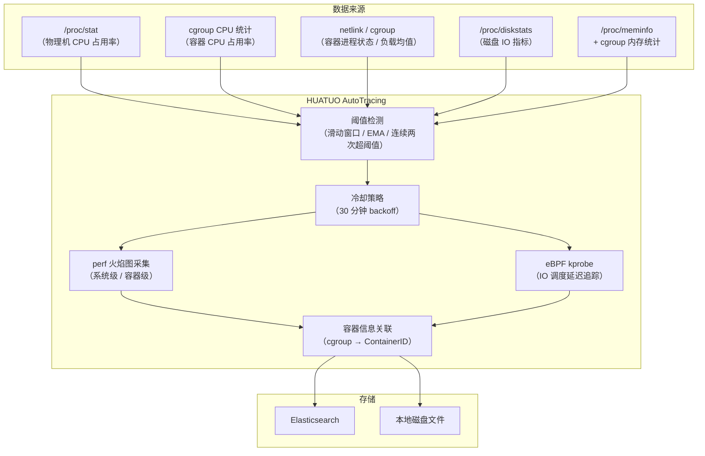
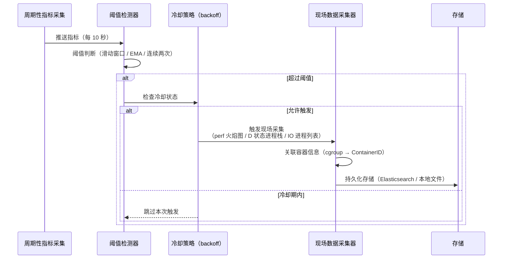

{}
<div style="text-align: center;">
HUATUO（华佗）是由滴滴开源并依托 CCF（中国计算机学会）孵化的操作系统深度观测项目，专注为云原生通用计算、AI 计算、云服务、基础服务等提供操作系统内核级深度观测能力。
</div>
{}

## 📖 概述

HUATUO AutoTracing（全自动化追踪）是一种事件驱动的自动诊断机制。当物理机或容器出现 CPU 突增、D 状态进程堆积、磁盘 IO 打满、内存突发分配等性能异常时，系统依据预设阈值自动触发现场数据采集，无需人工介入即可保留完整的诊断快照。

采集内容包括 eBPF 火焰图（`perf` 工具系统级或容器级 CPU 调用栈采样）、D 状态进程内核调用栈、磁盘 IO 调用栈、进程内存使用排行等。为避免持续触发导致的数据冗余，各事件均内置冷却策略（默认 30 分钟），确保在事件风暴期间仅保留关键快照。

当前支持 5 类事件：`cpusys`（物理机 CPU sys 突增，user/总 CPU 突增）、`cpuidle`（容器 CPU 使用率突增）、`dload`（容器及物理机 D 状态负载突增）、`iotracing`（磁盘 IO 异常）、`memburst`（物理机及容器内存突增）。

## 🎯 场景

**AI 训练任务 CPU 热点定位**：在 GPU 训练集群中，训练任务偶发性卡顿往往由内核态 CPU 占用率突增（`cpusys`）引起。AutoTracing 在 sys 占用率超过阈值的瞬间自动触发系统级 perf 火焰图采集，将内核调用栈热点以火焰图数据结构（`flamedata`）持久化，支持在故障消失后进行离线分析，避免人工复现困难。

**Kubernetes 容器 CPU 性能毛刺分析**：在微服务架构中，容器 CPU 使用率（`cpuidle`）的短暂突增可能导致响应延迟超时，但问题往往在告警响应前已恢复。AutoTracing 在容器 CPU 超阈值时自动触发容器级 perf 采样，生成精确到容器 cgroup 范围的火焰图，快速定位热点函数，降低依赖日志排查的时间成本。

**云原生环境 D 状态进程堆积排查**：在高 IO 负载或存储抖动时，容器内可能出现大量 D 状态（不可中断睡眠）进程，导致系统卡顿。`dload` 事件通过对容器负载均值进行指数加权移动平均（EMA）计算，在 D 状态进程负载超过阈值时自动抓取容器内及宿主机上相关进程的内核调用栈，精准定位阻塞根因。

**磁盘 IO 瓶颈根因定位**：在大数据或日志密集型业务中，磁盘 IO 利用率或写入带宽打满会导致应用请求堆积。`iotracing` 持续轮询 `/proc/diskstats`，在磁盘 IO 指标连续两次超过阈值时触发，采集高 IO 进程列表（含各进程读写字节数与打开文件详情）及正在等待 IO 调度的进程内核调用栈，快速缩小磁盘 IO 高消耗的进程范围。

## 🚀 使用

### 配置参数

各事件可通过以下参数进行调优，参数均提供默认值，无需配置即可运行：

| 参数 | 默认值 | 说明 |
| ---- | ------ | ---- |
| `cpuidle.user_threshold` | `75`（%） | 容器 CPU user 占用率触发阈值 |
| `cpuidle.sys_threshold` | `45`（%） | 容器 CPU sys 占用率触发阈值 |
| `cpuidle.usage_threshold` | `90`（%） | 容器 CPU 总占用率触发阈值 |
| `cpuidle.delta_user_threshold` | `45`（%） | 容器 CPU user 占用率增量触发阈值 |
| `cpuidle.delta_sys_threshold` | `20`（%） | 容器 CPU sys 占用率增量触发阈值 |
| `cpuidle.delta_usage_threshold` | `55`（%） | 容器 CPU 总占用率增量触发阈值 |
| `cpuidle.interval` | `10`（秒） | 检测间隔 |
| `cpuidle.interval_tracing` | `1800`（秒） | 同一容器触发冷却时间 |
| `cpuidle.run_tracing_tool_timeout` | `10`（秒） | perf 火焰图采集超时 |
| `cpusys.sys_threshold` | `45`（%） | 物理机 CPU sys 占用率触发阈值 |
| `cpusys.delta_sys_threshold` | `20`（%） | 物理机 CPU sys 占用率增量触发阈值 |
| `cpusys.user_threshold` | `0`（%） | user 占用率阈值；0 关闭 user 触发 |
| `cpusys.delta_user_threshold` | `0`（百分点） | user 占用率增量阈值 |
| `cpusys.usage_threshold` | `0`（%） | 总执行 CPU 占用率阈值；0 关闭 total 触发 |
| `cpusys.delta_usage_threshold` | `0`（百分点） | 总执行 CPU 占用率增量阈值 |
| `cpusys.interval` | `10`（秒） | 检测间隔 |
| `cpusys.interval_tracing` | `1800`（秒） | 全局触发冷却时间 |
| `cpusys.run_tracing_tool_timeout` | `10`（秒） | perf 火焰图采集超时 |
| `dload.threshold_load` | `5` | 容器不可中断进程负载 EMA 触发阈值 |
| `dload.host_threshold_load` | `5` | 物理机 D 状态任务数的一分钟 EMA 阈值 |
| `dload.interval` | `10`（秒） | 检测间隔 |
| `dload.interval_tracing` | `1800`（秒） | 各容器与物理机触发分别独立冷却 |
| `iotracing.rbps_threshold` | `2000`（MB/s） | 磁盘读吞吐率触发阈值 |
| `iotracing.wbps_threshold` | `1500`（MB/s） | 磁盘写吞吐率触发阈值 |
| `iotracing.util_threshold` | `90`（%） | 磁盘 IO 利用率触发阈值 |
| `iotracing.await_threshold` | `100`（ms） | 磁盘 IO 平均等待时间触发阈值 |
| `iotracing.run_tracing_tool_timeout` | `10`（秒） | IO 调用栈采集超时 |
| `iotracing.max_proc_dump` | `10` | 最多采集的高 IO 进程数 |
| `iotracing.max_files_per_proc_dump` | `5` | 每个进程最多采集的打开文件数 |
| `memburst.delta_memory_burst` | `100`（%） | 匿名内存相对滑动窗口最早采样的增长率阈值（100% 即 ≥ 2 倍时触发） |
| `memburst.delta_anon_threshold` | `70`（%） | 匿名内存占物理机 MemTotal 或容器有效内存限制的比例阈值 |
| `memburst.interval` | `10`（秒） | 检测间隔 |
| `memburst.interval_tracing` | `1800`（秒） | 物理机与各容器分别独立冷却 |
| `memburst.sliding_window_length` | `60` | 滑动窗口采样数（默认间隔下首尾相隔 590 秒） |
| `memburst.dump_process_max_num` | `10` | 最多采集的内存消耗进程数 |

### 事件列表

主机 dload 与容器 memburst 在对应 tracer 启用且满足依赖时运行。cpusys 新增的 user/总 CPU 触发还分别要求 `UserThreshold`/`UsageThreshold` 为正值，默认均关闭。表中参数名为简写，实际 TOML 配置键见[配置文档](../configuration/huatuo-bamai-configuration_zh.md)。

| 事件名称（tracer_name） | 观测对象 | 触发条件 | 典型场景 |
| ----------------------- | -------- | -------- | -------- |
| `cpusys` | 物理机 | 默认：sys > 45% 且 delta_sys > 20%。可选 user/total 触发要求占用率及其增量同时超过各自配置阈值。 | 物理机 CPU 突增、热点分析 |
| `cpuidle` | 容器 | (user>75% 且 delta_user>45%) 或 (sys>45% 且 delta_sys>20%) 或 (total>90% 且 delta_total>55%) | 容器 CPU 使用率突增、热点函数分析 |
| `dload` | 容器；整机 | D 状态任务数的一分钟 EMA > 5，阈值与冷却独立 | D 状态进程堆积、IO 阻塞 |
| `iotracing` | 物理机 | 磁盘 IO 指标连续两次超阈值 | 磁盘 IO 打满、IO 等待高延迟 |
| `memburst` | 物理机；容器 | 匿名内存 ≥ 窗口最早值 2 倍且占物理机 MemTotal 或容器有效内存限制 ≥ 70% | 内存突发分配、OOM 前兆 |

### 通用字段说明

所有事件数据均包含以下通用字段：

- **hostname**：物理机 hostname
- **region**：物理机所在可用区
- **uploaded_timestamp**：数据上传时间
- **container_id**：如果事件关联容器，则记录的容器 ID
- **container_hostname**：如果事件关联容器，则记录的容器 hostname
- **container_host_namespace**：如果事件关联容器，则记录容器的 K8s 命名空间
- **container_type**：容器类型
- **container_qos**：容器 QoS 级别
- **tracer_name**：事件名称（如 `cpusys`、`memburst` 等）
- **tracer_id**：此次的 tracing ID
- **started_timestamp**：触发 tracing 时间
- **tracer_type**：观测类型，自动追踪记录固定为 `autotracing`
- **tracer_data**：特定事件私有数据（详见各事件说明）

### 1. cpusys

**功能描述** 周期性读取 `/proc/stat`，计算物理机 CPU sys 占用率及相邻两次采样的增量。当 sys 占用率超过阈值（默认 45%）且增量超过阈值（默认 20%）时，触发系统级 perf 采样，生成全机 CPU 火焰图数据。全局默认冷却 30 分钟，避免重复触发。

启用 `cpusys` 后，可通过下列配置额外检测主机 user 和总执行 CPU 突增，复用原有 `/proc/stat` 采样、整机 perf 抓取、`cpusys` 存储格式与共享冷却，不增加 tracer、探针或周期读取。四个新增阈值默认均为 0；`UserThreshold` 或 `UsageThreshold` 为正值时才启用对应触发，未配置时保持原有仅 system 触发的行为。

```toml
[AutoTracing.CPUSys]
UserThreshold = 75
DeltaUserThreshold = 45
UsageThreshold = 90
DeltaUsageThreshold = 55
```

每组都要求占用率及相对上次采样的增量**同时超过**对应阈值；检测的是突增，不是所有持续高使用率。首个使用率样本只建立基线，原 system 阈值、采样间隔、抓取时长与冷却保持不变。

| 触发类型 | CPU 时间分子 |
| --- | --- |
| 原有 system | `system` |
| user | `user + nice` |
| 总执行 CPU | `user + nice + system + irq + softirq` |

分母为 `/proc/stat` 前八个 CPU 时间计数器之和的增量；guest 已包含在 user/nice 中，不重复累计。总执行时间排除 idle、iowait 和 steal，因为本机 on-CPU 抓取无法解释等待或被虚拟机管理器占用的时间。口径是包含容器工作的整机占用率，不是按容器配额归一化的使用率。

三组同时越线只抓取一次，共享冷却。`container_id` 仍为空，保留原 system JSON 字段，新增 `user_percent*`、`total_percent*` 和 `trigger_reasons`（`user`、`total`、`system`），零值新增字段省略。

验证范围：单元测试覆盖计数器计算、回退、默认值、触发组合、阈值边界及冷却，LocalFile 集成测试覆盖载荷持久化。`TestCPUHostLiveTrigger` 仅在设置 `HUATUO_CPU_LIVE_DIR` 时运行有界单进程负载，检查真实采样 → perf → LocalFile 本地文件路径。该目录需包含本次构建的 `perf` 可执行文件和 `perf.o`，仅在具备 BPF/perf 权限的测试虚拟机运行。

**数据存储** 事件数据自动存储至 Elasticsearch 或物理机磁盘文件。

**示例数据**

```json
{
    "tracer_name": "cpusys",
    "tracer_data": {
        "system_percent": 52,
        "system_percent_threshold": 45,
        "system_percent_delta": 25,
        "system_percent_delta_threshold": 20,
        "flamedata": [
            {"level": 0, "value": 1000, "self": 0, "label": "all"},
            {"level": 1, "value": 350, "self": 350, "label": "do_syscall_64"}
        ]
    }
}
```

**字段含义解释**

- **system_percent**：触发时物理机 CPU sys 占用率（%）
- **system_percent_threshold**：sys 占用率触发阈值（%）
- **system_percent_delta**：相邻两次采样的 sys 占用率增量（%）
- **system_percent_delta_threshold**：sys 增量触发阈值（%）
- **flamedata**：perf 采样生成的火焰图帧数据列表，每帧包含：
  - **level**：调用栈层级深度
  - **value**：该帧（含子帧）的采样计数
  - **self**：该帧自身（不含子帧）的采样计数
  - **label**：函数或进程名称标签

### 2. cpuidle

**功能描述** 周期性读取容器 cgroup CPU 统计，计算容器 CPU user、sys、总占用率及各指标的相邻增量。当任意一组阈值条件成立时（user>75% 且 delta_user>45%，或 sys>45% 且 delta_sys>20%，或 total>90% 且 delta_total>55%），触发容器级 perf 采样生成火焰图。同一容器默认 30 分钟冷却，避免重复触发。支持通过容器过滤器（`filter`）排除特定容器。

**数据存储** 事件数据自动存储至 Elasticsearch 或物理机磁盘文件。

**示例数据**

```json
{
    "tracer_name": "cpuidle",
    "tracer_data": {
        "user_percent": 80,
        "user_percent_threshold": 75,
        "user_percent_delta": 48,
        "user_percent_delta_threshold": 45,
        "system_percent": 12,
        "system_percent_threshold": 45,
        "system_percent_delta": 5,
        "system_percent_delta_threshold": 20,
        "total_percent": 92,
        "total_percent_threshold": 90,
        "total_percent_delta": 53,
        "total_percent_delta_threshold": 55,
        "flamedata": [
            {"level": 0, "value": 1000, "self": 0, "label": "all"},
            {"level": 1, "value": 800, "self": 800, "label": "java/com.example.App.main"}
        ]
    }
}
```

**字段含义解释**

- **user_percent / user_percent_threshold**：触发时容器 CPU user 占用率（%）及其阈值
- **user_percent_delta / user_percent_delta_threshold**：user 占用率增量（%）及其阈值
- **system_percent / system_percent_threshold**：触发时容器 CPU system 占用率（%）及其阈值
- **system_percent_delta / system_percent_delta_threshold**：system 占用率增量（%）及其阈值
- **total_percent / total_percent_threshold**：触发时容器 CPU 总占用率（%）及其阈值
- **total_percent_delta / total_percent_delta_threshold**：总占用率增量（%）及其阈值
- **flamedata**：容器级 perf 采样火焰图帧数据，字段含义同 `cpusys`

### 3. dload

**功能描述** cgroup v1 通过 netlink 读取容器内进程状态；cgroup v2 通过 BPF task iterator 批量读取。随后对不可中断（D 状态）进程的负载贡献进行指数加权移动平均（EMA）计算。当容器 D 状态负载 EMA 超过阈值（默认 5）时，采集容器内及宿主机中所有 D 状态进程的内核调用栈，支持已知问题过滤（`issues_list`）降低误报率。同一容器默认 30 分钟冷却。cgroup v2 路径每次采样都会遍历一次宿主机全部任务，它要求内核 BTF 可读并支持 BPF `task` iterator。统计为非层级统计，只包含直接挂在目标 cgroup 下的任务，不递归包含子 cgroup。内核不支持或 verifier 不兼容时，首次采样会将 `dload` 标记为不支持并停止该检测项，且不会周期性重试加载。

Kubernetes 部署必须为 Huatuo 设置 `hostPID: true`。无法访问宿主机 PID namespace 时，cgroup v2 dload 会被标记为不支持，而不是返回有误导性的全零计数。

`dload` 启用后独立检测包含容器线程的整机 D 状态负载，不是仅统计非容器任务。`HostThresholdLoad` 默认 5，主机一分钟 D 状态 EMA 超过阈值后抓取堆栈，与容器触发分别维护阈值和冷却；事件名和数据结构不变。

主机路径在 cgroup v1/v2 下均复用已有 BPF task iterator，需要内核 BTF、BPF 权限及宿主机 PID 可见性（上游 iterator 基础支持始于 Linux 5.8）。v2 的一次 iterator 快照同时提供主机和容器统计；不支持 iterator 的 v1 内核只停止主机触发，保留原 netlink 容器路径。D-load 是采样估计值，不是 `/proc/loadavg`；主机堆栈覆盖线程，不限于进程组长。主机与容器同时越线时分别输出事件。

采样遵循 `AutoTracing.Dload.Interval`（默认 10 秒），不使用 `MetricCollector.Loadavg.Interval`。不增加 BPF 探针或 map；除可复用兼容的新鲜快照外，每次采样遍历一次主机任务。

验证范围：5.10 测试虚拟机中，有界 `vfork` worker 在子进程退出前保持 D 状态。关闭 debug、采样间隔设为 1 秒、主机阈值设为 0 时，采集到 D=1、D-load=0.02，无需容器发现即可独立触发，并在 LocalFile 本地文件中确认包含 worker 内核堆栈的记录。debug 抓取测试也读取本地文件，不将未配置的 `Save` 当作持久化证据。实机测试需要 `HUATUO_TRIGGER_BPF_DIR`，正常触发测试另需 `HUATUO_DLOAD_WORKER_PID`。仅在可丢弃的虚拟机运行，fixture 必须自行退出，不创建无限期 D 状态任务。

**数据存储** 事件数据自动存储至 Elasticsearch 或物理机磁盘文件。

**示例数据**

```json
{
    "tracer_name": "dload",
    "tracer_data": {
        "threshold": 5,
        "nr_sleeping": 120,
        "nr_running": 4,
        "nr_stopped": 0,
        "nr_uninterruptible": 8,
        "nr_iowait": 3,
        "load_avg": 7.23,
        "dload_avg": 6.81,
        "known_issue": "",
        "stack": "task:java            state:D stack:    0 pid: 12345 tgid: 12345 ...\n  io_schedule+0x18/0x40\n  ext4_file_write_iter+0x..."
    }
}
```

**字段含义解释**

- **threshold**：D 状态负载 EMA 触发阈值
- **nr_sleeping**：容器内睡眠状态进程数
- **nr_running**：容器内运行状态进程数
- **nr_stopped**：容器内停止状态进程数
- **nr_uninterruptible**：容器内不可中断（D 状态）进程数
- **nr_iowait**：容器内 IO 等待状态进程数
- **load_avg**：触发时容器负载均值
- **dload_avg**：触发时容器 D 状态负载 EMA 值
- **known_issue**：命中的已知问题描述（为空表示未命中）
- **stack**：D 状态进程的内核调用栈（多进程多行文本）

### 4. iotracing

**功能描述** 以 5 秒间隔轮询 `/proc/diskstats`，计算各磁盘设备的读写吞吐率、IO 利用率及 IO 等待时间。当任一指标连续两次采样均超过对应阈值时触发（自动忽略 md 设备），采集高 IO 进程列表（含各进程的读写字节数及打开文件统计）以及正在等待 IO 调度的进程内核调用栈。

**数据存储** 事件数据自动存储至 Elasticsearch 或物理机磁盘文件。

**示例数据**

```json
{
    "tracer_name": "iotracing",
    "tracer_data": {
        "reason_snapshot": {
            "type": "ioutil",
            "device": "sda",
            "iostatus": {
                "read_bps": 120,
                "read_iops": 450,
                "read_await": 12,
                "write_bps": 2100,
                "write_iops": 890,
                "write_await": 145,
                "io_util": 95,
                "queue_size": 32
            }
        },
        "process_io_data": [
            {
                "pid": 12345,
                "comm": "java",
                "container_hostname": "app-pod-xxx",
                "fs_read": 0,
                "fs_write": 52428800,
                "disk_read": 0,
                "disk_write": 49152000,
                "file_stat": ["/data/logs/app.log"],
                "file_count": 1
            }
        ],
        "timeout_io_stack": [
            {
                "pid": 12345,
                "comm": "java",
                "container_hostname": "app-pod-xxx",
                "latency_us": 250000,
                "stack": {
                    "back_trace": [
                        "io_schedule+0x18/0x40",
                        "ext4_file_write_iter+0x2a0/0x4c0"
                    ]
                }
            }
        ]
    }
}
```

**字段含义解释**

- **reason_snapshot**：触发 IO 采集的原因快照
  - **type**：触发类型（`ioutil` IO 利用率 / `read_bps` 读吞吐率 / `write_bps` 写吞吐率 / `read_await` 读等待时间 / `write_await` 写等待时间）
  - **device**：触发阈值的磁盘设备名称
  - **iostatus**：触发时各磁盘 IO 指标快照（`read_bps`/`write_bps` 单位 MB/s，`read_await`/`write_await` 单位 ms，`io_util` 单位 %，`queue_size` 为队列深度）
- **process_io_data**：高 IO 进程列表，每条记录包含：
  - **pid / comm**：进程 PID 与进程名
  - **container_hostname**：进程所在容器 hostname（宿主机进程为空）
  - **fs_read / fs_write**：进程文件系统层面的读写字节数
  - **disk_read / disk_write**：进程磁盘层面的实际读写字节数
  - **file_stat**：进程当前打开的文件路径列表
  - **file_count**：进程打开的文件总数
- **timeout_io_stack**：等待 IO 调度的进程调用栈列表，每条记录包含：
  - **pid / comm**：进程 PID 与进程名
  - **container_hostname**：进程所在容器 hostname
  - **latency_us**：IO 等待时长（微秒）
  - **stack.back_trace**：内核调用栈帧列表

### 5. memburst

**功能描述** 周期性采样物理机匿名内存（anonymous memory）使用量，维护长度为 60 个采样点（默认间隔下首尾相隔 590 秒）的滑动窗口。当当前匿名内存 ≥ 窗口最早采样值的 2 倍，且匿名内存占物理机总内存 ≥ 70% 时触发，采集内存消耗最多的前 N 个进程（默认 10 个）的 PID、进程名和 RSS 内存值。默认 30 分钟冷却。

`memburst` 启用后独立检测主机和容器匿名内存突增，复用 `DeltaMemoryBurst`、`DeltaAnonThreshold`、`SlidingWindowLength`、`Interval`、`IntervalTracing`、`DumpProcessMaxNum`、窗口比较及 RSS 进程排行。事件仍为 `memburst`，数据结构不变，容器事件填写对应容器 ID，无需主机先触发。

v1 读取 `total_active_anon + total_inactive_anon`，v2 读取 `active_anon + inactive_anon`。比例分母取主机 MemTotal 与有效内存限制的较小值：v1 使用 `hierarchical_memory_limit`，v2 使用各级祖先 `memory.max` 的最小值；无限制时使用 MemTotal。与主机口径一致，匿名 LRU 不是 cgroup 总内存用量，也可能包含 shmem。

各容器独立维护历史窗口与冷却。生成非空快照后、写入存储前开始冷却，存储失败也不会绕过冷却。容器发现或内存读取失败、路径或限制变化时重置历史，但保留冷却；成功发现结果中已消失的容器会清理状态。仅在触发且不处于冷却时递归读取 `cgroup.procs`。RSS 排行之和不必等于 cgroup 计费内存。环形窗口比较最新与最旧保留样本：60 个样本、10 秒间隔，首尾相隔 590 秒。

不增加 BPF 探针或 map。每轮读取内存计数器和祖先限制，每个存活容器保留一个有界历史环；仅触发时遍历进程。开发机共享窗口函数基准约 23 ns/样本、零分配，不包含文件读取和快照开销，不能作为端到端开销结论。

验证范围：5.10 hybrid 测试虚拟机中，隔离的 128 MiB v1 内存 cgroup 内有界 worker 的匿名 LRU 从 8176 增至 110596 KiB，真实计数跨过两样本测试窗口的翻倍和限制占比 70% 阈值，RSS 快照包含该 worker。`TestContainerBurstLiveGrowth` 通过 `HUATUO_MEMBURST_WORKER_PID` 接收 PID，不自行制造压力。已验证计数器、阈值与快照，未验证 kubelet 发现及容器事件持久化；虚拟机无 kubelet，端到端路径及纯 v2 实机内存场景仍未验证。v2 祖先限制由 fixture 覆盖；测试 worker 和 cgroup 已清理。

**数据存储** 事件数据自动存储至 Elasticsearch 或物理机磁盘文件。

**示例数据**

```json
{
    "tracer_name": "memburst",
    "tracer_data": {
        "top_memory_usage": [
            {
                "pid": 3456,
                "process_name": "java",
                "memory_size": 8589934592
            },
            {
                "pid": 3789,
                "process_name": "python3",
                "memory_size": 2147483648
            }
        ]
    }
}
```

**字段含义解释**

- **top_memory_usage**：内存消耗最多的进程列表（按 RSS 降序排列），每条记录包含：
  - **pid**：进程 PID
  - **process_name**：进程名称
  - **memory_size**：进程 RSS 内存占用（字节）

## ⚙️ 原理

### 整体架构

HUATUO AutoTracing 以周期性轮询为基础，结合 eBPF 调用栈采集与 perf 火焰图生成，在内核层实现低开销的异常诊断数据采集。



### 事件处理流程



{}
<div style="text-align: center;">
🌟 欢迎 Star: <a href="https://github.com/ccfos/huatuo" target="_blank">https://github.com/ccfos/huatuo</a>
<br><br>
👀 欢迎订阅官方微信公众号<br>

</div>
{}
