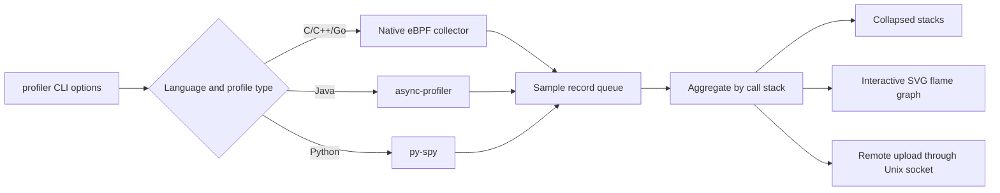

{}
<div style="text-align: left;">
HUATUO is an operating-system observability project open sourced by DiDi and incubated by the China Computer Federation (CCF). It is used in AI computing, AI sandboxes, cloud-native general-purpose computing, cloud services, and infrastructure services.
</div>
{}

## 🌐 Profiles API

huatuo-apiserver exposes `/v1/profiles` for service-based continuous profiling. Clients can create CPU or memory profiling jobs, query job status and results, and stop or delete jobs. huatuo-apiserver schedules each job on the HUATUO Agent running on the specified node. Profiling results are available through the returned Grafana URL or the raw data endpoint.

### 1. Request Conventions

By default, huatuo-apiserver listens on `:12740`. The following examples use environment variables for the server address and user ID:

```bash
API_BASE="http://127.0.0.1:12740"
USER_ID="<Auth.users.ID>"
```

Every request must pass the configured user ID as a bearer token:

```text
Authorization: Bearer <Auth.users.ID>
```

A non-administrator user requires both `/v1/profiles` and
`/v1/profiles/**` permissions. Permissions may include an HTTP method, such as
`GET /v1/profiles/**`. The API uses the following common JSON response
envelope:

```json
{
  "code": 0,
  "message": "success",
  "data": {}
}
```

### 2. Query Profiling Capabilities

Before creating a job, query the profiling types, languages, memory modes, and runtime settings supported by the server:

```bash
curl -sS \
  -H "Authorization: Bearer ${USER_ID}" \
  "${API_BASE}/v1/profiles/capabilities"
```

The `data` object contains these fields:

| Field | Description |
| --- | --- |
| `types` | Supported profiling types: `cpu` and `memory` |
| `cpu_languages` | Languages supported by CPU profiling |
| `memory_languages` | Languages supported by memory profiling |
| `memory_modes` | Memory profiling modes; keys are display names and values are used when creating jobs |
| `aggregation_interval` | Server-side data aggregation interval in seconds |
| `execution_timeout` | Execution timeout for one profiler subprocess in seconds |
| `max_profiler_procs` | Maximum number of concurrent third-party profiler subprocesses; `0` disables the limit |

CPU profiling currently supports `c`, `c++`, `go`, `java`, and `python`. Memory profiling supports these combinations:

| Language | `memory_mode` | Description |
| --- | --- | --- |
| `c`, `c++`, `go` | `virtual_alloc` | Virtual address-space allocation |
| `c`, `c++`, `go` | `physical_alloc` | Physical page allocation |
| `c`, `c++`, `go` | `physical_usage` | Current physical page residency |
| `java` | `object_alloc` | JVM object allocation |
| `java` | `object_usage` | JVM live objects |

### 3. Create a Profiling Job

`POST /v1/profiles` accepts the following JSON fields:

| Field | Required | Description |
| --- | --- | --- |
| `type` | Yes | Profiling type: `cpu` or `memory` |
| `language` | Yes | Target process language; it must support the selected profiling type |
| `duration` | Yes | Profiling duration in seconds |
| `hostname` | Yes | Hostname of the node running the target process; used for job scheduling |
| `container_id` | No | Target container ID; omit it to profile the host |
| `binary_match_path` | No | Executable path matcher for Java/Python CPU profiling; native profiling does not support it |
| `memory_mode` | For memory profiling | Memory profiling mode; it must be supported by `language` |

`duration` must cover at least two `aggregation_interval` periods, and `duration + aggregation_interval` must be less than 3600 seconds. If the same user already has a running profiling job on the same node, the server returns `409 Conflict`.

Create a Go CPU profiling job on a host:

```bash
curl -sS -i \
  -X POST \
  -H "Authorization: Bearer ${USER_ID}" \
  -H "Content-Type: application/json" \
  -d '{
    "type": "cpu",
    "language": "go",
    "duration": 60,
    "hostname": "node-01"
  }' \
  "${API_BASE}/v1/profiles"
```

Create a Java live-object profiling job in a container:

```bash
curl -sS -i \
  -X POST \
  -H "Authorization: Bearer ${USER_ID}" \
  -H "Content-Type: application/json" \
  -d '{
    "type": "memory",
    "language": "java",
    "memory_mode": "object_usage",
    "duration": 60,
    "container_id": "9f4c2f1a8b7d",
    "hostname": "node-01"
  }' \
  "${API_BASE}/v1/profiles"
```

A successful request returns `201 Created`. The `Location` response header identifies the new job, and the response body contains the job ID used by subsequent requests:

```json
{
  "code": 0,
  "message": "success",
  "data": {
    "id": "<profile-job-id>"
  }
}
```

```bash
JOB_ID="<profile-job-id>"
```

### 4. List Profiling Jobs

`GET /v1/profiles` supports these query parameters:

| Parameter | Default | Description |
| --- | --- | --- |
| `container_id` | None | Exact container ID filter (`containerID` remains accepted for compatibility) |
| `hostname` | None | Exact node hostname filter |
| `status` | None | `pending`, `running`, `completed`, `failed`, `stopped`, or `timeout` |
| `type` | None | `cpu` or `memory`; omit it to return both types |
| `limit` | `50` | Page size; must be greater than 0 and is capped at 500 |
| `offset` | `0` | Starting offset; must be greater than or equal to 0 |
| `sort` | `-start_time` | `start_time`, `end_time`, `host`, or `container`; prefix with `-` for descending order |

List the 20 most recent running CPU profiling jobs on `node-01`:

```bash
curl -sS -G \
  -H "Authorization: Bearer ${USER_ID}" \
  --data-urlencode "hostname=node-01" \
  --data-urlencode "status=running" \
  --data-urlencode "type=cpu" \
  --data-urlencode "limit=20" \
  --data-urlencode "offset=0" \
  --data-urlencode "sort=-start_time" \
  "${API_BASE}/v1/profiles"
```

`data.items` contains the job array. `data.total` is the number of matching jobs before pagination, while `data.limit` and `data.offset` are the effective pagination parameters. Non-administrator users can list only jobs they created.

### 5. Get a Profiling Job

```bash
curl -sS \
  -H "Authorization: Bearer ${USER_ID}" \
  "${API_BASE}/v1/profiles/${JOB_ID}"
```

The `data` object contains the job details:

| Field | Description |
| --- | --- |
| `id` | Profiles API job ID |
| `agent_task_id` | HUATUO Agent task ID |
| `container_id` | Target container ID; empty for host jobs |
| `hostname` | Target node hostname |
| `type` | `cpu` or `memory` |
| `language` | Target process language |
| `memory_mode` | Memory profiling mode; empty for CPU jobs |
| `binary_match_path` | Executable path matcher specified when the job was created |
| `status` | Current job status |
| `start_time`, `end_time` | Job start and end times; empty until available |
| `tracer_args` | Command-line arguments sent by huatuo-apiserver to profiler |
| `duration` | Requested profiling duration in seconds |
| `results.url` | Grafana URL for the profiling result; empty until the result is available |
| `error_message` | Error details for a failed or timed-out job |

Profiling jobs use these statuses:

| Status | Description |
| --- | --- |
| `pending` | The job has been created and is waiting for the Agent |
| `running` | The Agent is collecting profiling data |
| `completed` | The job completed successfully |
| `stopped` | The user or job manager stopped the job |
| `failed` | The job failed; inspect `error_message` for the cause |
| `timeout` | The job exceeded its allowed execution time |

### 6. Get Raw Profiling Data

`GET /v1/profiles/:id/raw` uses `agent_task_id` to query raw profiling data from storage. The response can be large, so it can be written directly to a file:

```bash
curl -sS \
  -H "Authorization: Bearer ${USER_ID}" \
  -o profile-raw.json \
  "${API_BASE}/v1/profiles/${JOB_ID}/raw?limit=100&offset=0"
```

The raw records are in `data.data`; `data.limit`, `data.offset`, and
`data.has_more` describe the page. If the job does not yet have an Agent task
ID, the endpoint returns `400 Bad Request`.

### 7. Stop a Profiling Job

Only jobs in `pending` or `running` status can be stopped. The `PATCH` request accepts only `stopped` as the `status` value:

```bash
curl -sS \
  -X PATCH \
  -H "Authorization: Bearer ${USER_ID}" \
  -H "Content-Type: application/json" \
  -d '{"status":"stopped"}' \
  "${API_BASE}/v1/profiles/${JOB_ID}"
```

A successful stop returns `200 OK`. A job that has already ended returns `400 Bad Request`.

### 8. Delete a Profiling Job

Deletion removes only the job record. Jobs in `pending` or `running` status cannot be deleted directly and must be stopped first:

```bash
curl -sS -i \
  -X DELETE \
  -H "Authorization: Bearer ${USER_ID}" \
  "${API_BASE}/v1/profiles/${JOB_ID}"
```

A successful deletion returns `204 No Content` with no response body. If the job is still active, the endpoint returns `409 Conflict`.

## 📖 profiler CLI Overview

`profiler` is HUATUO's standalone performance profiling CLI. It samples host processes or processes inside containers without requiring huatuo-apiserver, Elasticsearch, or Grafana. The tool supports C, C++, Go, Java, and Python processes and writes call stacks as folded stacks or SVG flame graphs.

C, C++, and Go use the eBPF-based native collector to observe on-CPU usage, off-CPU blocking and scheduling delay, virtual memory allocation, physical memory allocation, and physical memory residency. Java uses async-profiler to observe CPU usage, object allocation, and live objects. Python uses py-spy to observe CPU usage. The results can be used to locate hot functions, attribute memory growth, analyze processes inside containers, and preserve performance data for later diagnosis.

The remainder of this section covers standalone use of `_output/bin/profiler`. For service-based continuous profiling, see the Profiles API section above.

## 🎯 Use Cases

### 1. Locate CPU Hotspots and Call Paths

Sample the call stacks of C, C++, Go, Java, or Python processes at a fixed frequency and use stack width to identify the primary consumers of CPU time. The native collector can also limit sampling to selected CPUs with `--cpuid`, which is useful for analyzing CPU-pinned workloads or per-CPU hotspots.

### 2. Attribute Native Process Memory

Observe virtual address-space allocation, physical page allocation, and current physical page residency for C, C++, and Go processes. These modes distinguish between how much address space was requested, how much physical memory was allocated, and how much physical memory remains resident. They help locate call paths responsible for `mmap` activity, page-fault allocation, and resident memory growth.

### 3. Analyze JVM Object Allocation and Live Objects

Use async-profiler to collect Java object allocation or live-object call stacks. Object allocation profiles help locate high allocation rates and sources of GC pressure. Live-object profiles help identify objects that remain referenced during the collection window and the paths where they were allocated.

### 4. Analyze Containers and Multi-process Workloads

Use a container ID to resolve and profile target processes inside Docker or containerd workloads. Java and Python also accept comma-separated PID lists and can limit the number of concurrently running collector subprocesses, which is useful for service replicas and parent-child process groups.

## 🚀 Usage

### 1. Build and Runtime Requirements

Build all artifacts from the repository root:

```bash
make all
```

The resulting executable is `_output/bin/profiler`. Native profiling depends on Linux eBPF, perf events, and the BPF objects built from this repository. It generally requires root privileges and a `kernel.perf_event_paranoid` setting that permits sampling. Java profiling requires async-profiler; `--tool-path` must point to a directory containing `bin/asprof` and `lib/libasyncProfiler.so`. Python profiling requires py-spy; `--tool-path` must point to a directory containing the `py-spy` executable.

Display the complete help for the current version:

```bash
_output/bin/profiler --help
```

The basic command structure is:

```bash
sudo _output/bin/profiler \
  --type <cpu|memory> \
  --language <c|c++|go|java|python> \
  --pid <pid> \
  --duration 30 \
  --aggr-interval 10 \
  --output-format flamegraph \
  --output-path ./profiles
```

`--type` and `--language` are required. Java, Python, and native memory profiling require exactly one target specified with either `--pid` or `--container-id`. Native CPU profiling can sample the entire host when neither target is specified.

### 2. General CLI Options

| Option | Default | Scope | Description |
| --- | --- | --- | --- |
| `--type`, `-t` | None | All | Profile type: `cpu` or `memory`; required |
| `--language`, `-l` | None | All | Target language: `c`, `c++`, `go`, `java`, or `python`; required |
| `--pid`, `-p` | None | All | Target PID; Java and Python accept comma-separated PIDs, while native profiling accepts at most one PID |
| `--container-id` | None | All | Target container ID; mutually exclusive with `--pid` |
| `--duration`, `-d` | `10` | All | Total profiling duration in seconds; minimum 1 |
| `--aggr-interval` | `10` | All | Aggregation interval in seconds; must not exceed the duration |
| `--freq`, `-F` | `99` | CPU | Samples collected per second; maximum 1000 for Java |
| `--output-path` | `.` | Local output | Output directory, not an output file name |
| `--output-format` | `collapsed` | All | `collapsed`, `flamegraph`, `svg`, or `remote` |
| `--output-storage` | `/var/run/huatuo-toolstream.sock` | `remote` | Unix socket used for remote upload |
| `--max-concurrent-procs` | `0` | Java, Python | Maximum concurrent collector subprocesses; `0` means unlimited |
| `--tool-path` | None | Java, Python | Third-party profiler root directory; required |
| `--binary-match-path` | None | Java, Python | Executable path used to match target processes |
| `--huatuo-api-address` | `127.0.0.1:19704` | Container targets | HUATUO API address used to resolve container metadata |
| `--tracer-id` | Generated | All | Profiling task ID, primarily used to associate remote storage records |
| `--enable-pprof` | `false` | Profiler itself | Expose Go pprof endpoints for the profiler process on `:6000` |
| `--version-format` | `text` | Version query | Output format for `--version`: `text`, `json`, or `short` |
| `--help`, `-h` | - | All | Display command help |
| `--version`, `-v` | - | All | Display version and build information |

Native profiling options:

| Option | Default | Scope | Description |
| --- | --- | --- | --- |
| `--memory-mode` | None | Native memory, Java memory | Memory profiling mode; required with `--type memory` |
| `--cpuid` | All CPUs | Native CPU | Comma-separated CPU list or ranges, for example `1,3,5-10` |
| `--cpu-mode` | `oncpu` | Native CPU | `oncpu` for frequency sampling or `offcpu` for blocked/runnable delay attribution |
| `--offcpu-metric` | `total` | Native off-CPU | Accumulate `total`, `blocked`, or `runnable` time |
| `--offcpu-min-us` | `1000` | Native off-CPU | Discard phase intervals shorter than this many microseconds |
| `--offcpu-max-us` | `0` | Native off-CPU | Discard phase intervals longer than this value; `0` disables the maximum |
| `--thread-group` | `false` | Native | Also profile other threads in the target PID's thread group |
| `--physical-memory-probability` | `100` | Native physical memory | Physical memory event sampling probability from 1 to 100 |
| `--log-bpf-debug` | `false` | Native | Emit BPF debug events; not recommended for normal profiling |

Logging options:

| Option | Default | Description |
| --- | --- | --- |
| `--log-level` | `error` | `trace`, `debug`, `info`, `warn`, or `error` |
| `--log-file` | `stdout` | Log file path, or `stdout` |
| `--log-size` | `100` | Log rotation size in MB; `0` disables rotation; applies only to file output |
| `--verbose` | `false` | Equivalent to `--log-level debug --log-file stdout` and overrides both explicit logging options |

### 3. Observing C, C++, and Go

C, C++, and Go use the same native eBPF collector; only the `--language` value changes. CPU mode counts call-stack samples and includes user-space and kernel-space stacks when symbols can be resolved.

```bash
sudo _output/bin/profiler \
  --type cpu \
  --language go \
  --pid 12345 \
  --duration 30 \
  --aggr-interval 10 \
  --freq 99 \
  --output-format flamegraph \
  --output-path ./profiles/go-cpu
```

Add `--thread-group` to include worker threads in the same process. Add `--cpuid 2,4-7` to limit collection to selected CPUs. Native CPU profiling also supports container-level and host-level collection:

```bash
# Profile a specific container
sudo _output/bin/profiler \
  --type cpu --language c --container-id <container-id> \
  --duration 30 --aggr-interval 10 \
  --output-format collapsed --output-path ./profiles/container

# Profile the host without specifying a PID or container
sudo _output/bin/profiler \
  --type cpu --language c \
  --duration 30 --aggr-interval 10 \
  --output-format flamegraph --output-path ./profiles/host
```

To attribute time spent outside the CPU to the call path that descheduled, select off-CPU mode:

```bash
sudo _output/bin/profiler \
  --type cpu --language go --pid 12345 --thread-group \
  --cpu-mode offcpu --offcpu-metric total \
  --offcpu-min-us 1000 \
  --duration 30 --aggr-interval 10 \
  --output-format flamegraph --output-path ./profiles/go-offcpu
```

Off-CPU output is event-driven, so `--freq` does not apply. `--cpuid` is also rejected because scheduler tracepoints observe task migration globally. Flame graphs use nanoseconds directly and add roots such as `off-CPU blocked`, `scheduling delay (preempted)`, and `scheduling delay (yielded)`. In `total` mode, blocked and runnable phases are both included but remain separated by these roots. A single stable BPF stack map is used so a long sleep cannot be resolved against a later rotating stack-map generation.

Native memory profiling supports these dimensions:

| `--memory-mode` | Measurement | Suitable for |
| --- | --- | --- |
| `virtual_alloc` | Virtual address-space allocation and its call stacks | Excessive `mmap` activity and address-space growth |
| `physical_alloc` | Physical memory newly allocated during the collection window | Physical page allocation triggered by page faults and allocation-rate analysis |
| `physical_usage` | Physical memory still resident at collection time | Sources of resident memory and paths retaining physical pages |

```bash
sudo _output/bin/profiler \
  --type memory \
  --language c++ \
  --memory-mode physical_usage \
  --pid 12345 \
  --thread-group \
  --physical-memory-probability 100 \
  --duration 30 \
  --aggr-interval 10 \
  --output-format flamegraph \
  --output-path ./profiles/native-memory
```

`--physical-memory-probability` applies only to `physical_alloc` and `physical_usage`. Lowering it reduces processing for high-frequency memory events, but flame-graph values are then estimates based on sampled events rather than counts of every event.

### 4. Observing Java

Java CPU profiling depends on async-profiler. It supports a single PID, a container, or multiple PIDs:

```bash
_output/bin/profiler \
  --type cpu \
  --language java \
  --pid 12345,12346 \
  --tool-path /opt/async-profiler \
  --max-concurrent-procs 2 \
  --duration 30 \
  --aggr-interval 10 \
  --freq 99 \
  --output-format flamegraph \
  --output-path ./profiles/java-cpu
```

Java memory profiling supports two dimensions:

| `--memory-mode` | Measurement | Suitable for |
| --- | --- | --- |
| `object_alloc` | Objects allocated during the collection window and their allocation call stacks | High allocation rates, short-lived objects, and sources of GC pressure |
| `object_usage` | Live objects and their allocation call stacks | Long-lived objects, sources of heap usage, and suspected memory leaks |

```bash
_output/bin/profiler \
  --type memory \
  --language java \
  --memory-mode object_usage \
  --pid 12345 \
  --tool-path /opt/async-profiler \
  --duration 30 \
  --aggr-interval 10 \
  --output-format flamegraph \
  --output-path ./profiles/java-memory
```

To target a container, replace `--pid` with `--container-id <container-id>`. If a container has multiple candidate processes, use `--binary-match-path` to select the target executable path.

### 5. Observing Python

Python currently supports CPU profiling only. `--aggr-interval` must equal `--duration`, so one collection produces one aggregation window. `--tool-path` must point to the directory containing `py-spy`.

```bash
_output/bin/profiler \
  --type cpu \
  --language python \
  --pid 12345,12346 \
  --tool-path /opt/py-spy \
  --max-concurrent-procs 2 \
  --duration 30 \
  --aggr-interval 30 \
  --freq 99 \
  --output-format flamegraph \
  --output-path ./profiles/python-cpu
```

Python does not support `--type memory`. Use a separate memory analysis tool for Python memory profiling; the current `profiler` command does not invoke memray to generate Python memory profiles.

### 6. Choosing a Flame Graph and Output Format

| Format | Output | When to use it |
| --- | --- | --- |
| `collapsed` | `perf_<Unix timestamp>.folded`; each line contains a semicolon-separated call stack followed by a count | Scripted searches, result comparison, or rendering later with another flame-graph tool |
| `flamegraph` | `flamegraph_<Unix timestamp>.svg`; an SVG with embedded interaction scripts | Default format for manual analysis; supports searching, zooming, and inspecting frame values in a browser |
| `svg` | The same interactive SVG as `flamegraph` | Compatibility with callers that explicitly request SVG; currently equivalent to `flamegraph` |
| `remote` | No local flame graph; uploads pprof-compatible data through a Unix socket | Integration with the HUATUO storage pipeline; not suitable for offline viewing |

A flame graph shows the call direction from bottom to top. Rectangle width represents the cumulative value for that call stack in the selected profiling mode. For CPU profiles, width represents the proportion of CPU time derived from sample counts. For memory profiles, it represents virtual allocation, physical allocation, physical residency, Java object allocation, or live-object volume, depending on the selected mode. Horizontal position does not represent chronological order.

Example folded stacks:

```text
main;handleRequest;parsePayload 428
main;handleRequest;writeResponse 172
```

Choose `collapsed` when you need to retain raw data and later render it with different colors or filters. Choose `flamegraph` when you want to inspect hotspots directly. `remote` depends on the HUATUO toolstream Unix socket and should not be selected for standalone offline use.

### 7. Reproducing Integration Test Examples

The repository's integration tests provide executable end-to-end examples. Each test creates a target process, runs profiler, and verifies the expected call stack in the output:

```bash
# Native CPU
sudo ./integration/run.sh test_profiler_native_cpu.sh

# Native off-CPU blocking and scheduling delay
sudo ./integration/run.sh test_profiler_native_cpu_offcpu.sh

# Native virtual and physical memory
sudo ./integration/run.sh test_profiler_native_mem_virtual_alloc.sh
sudo ./integration/run.sh test_profiler_native_mem_physical_usage.sh

# Java CPU and memory
sudo ./integration/run.sh test_profiler_java_cpu_multi_pid.sh
sudo ./integration/run.sh test_profiler_java_memory_usage_alloc.sh

# Python multi-process CPU
sudo ./integration/run.sh test_profiler_python_cpu_multi_pid.sh
```

Container, thread-group, and CPU-selection examples are available in `test_profiler_native_cpu_container.sh`, `test_profiler_native_cpu_thread_group.sh`, and `test_profiler_native_cpu_cpuid.sh`, respectively. Run `make all` first and configure the Java or Python profiler path in `integration/env.sh` as needed.

## ⚙️ How It Works

`profiler` first selects a collector based on the language and profile type. The native on-CPU collector attaches eBPF programs to perf events; off-CPU mode attaches scheduler switch, wakeup, exit, and task-free tracepoints. Native memory collectors record allocation and release paths through kernel events. The Java and Python collectors start async-profiler and py-spy subprocesses, respectively. Collected records enter a common aggregation pipeline, which merges counts by call stack and then writes a local file or uploads the result to remote storage.



`--duration` controls the collection lifetime, while `--aggr-interval` controls the snapshot interval for remote uploads. Local `collapsed`, `flamegraph`, and `svg` modes write the final aggregate when collection ends. `remote` creates and uploads snapshots at the aggregation interval. The queue decouples collection from symbolization, aggregation, and output so file rendering does not block the sampling path.

## 🌟 Conclusion

{}
<div style="text-align: left;">
🌟 Star HUATUO on GitHub: <a href="https://github.com/ccfos/huatuo" target="_blank">https://github.com/ccfos/huatuo</a>
<br><br>
👀 Follow the official WeChat account<br>

</div>
{}
