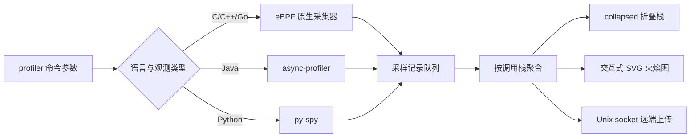

{}
<div style="text-align: left;">
HUATUO（华佗）是由滴滴开源并依托 CCF（中国计算机学会）孵化的操作系统深度观测项目，广泛应用于AI 计算、AI 沙箱、云原生通用计算、云服务、基础架构服务等场景。
</div>
{}

## 🌐 Profiles API

huatuo-apiserver 通过 `/v1/profiles` 提供服务化的持续性能剖析能力。客户端可以创建 CPU 或内存剖析任务，查询任务状态和结果，或者停止、删除任务。任务由 huatuo-apiserver 调度到指定节点的 HUATUO Agent，采集结果可通过返回的 Grafana 链接或原始数据接口查看。

### 1. 请求约定

huatuo-apiserver 默认监听 `:12740`。以下示例使用环境变量统一设置服务地址和用户 ID：

```bash
API_BASE="http://127.0.0.1:12740"
USER_ID="<Auth.users.ID>"
```

每个请求必须在 `Authorization` 请求头中直接传入 `huatuo-apiserver.conf` 配置的用户 ID：

```text
Authorization: <Auth.users.ID>
```

非管理员用户需要配置 `/v1/profiles` 和 `/v1/profiles/**` 权限。接口使用统一 JSON 响应格式：

```json
{
  "code": 0,
  "message": "success",
  "data": {}
}
```

### 2. 查询剖析能力

创建任务前，建议先查询服务端支持的剖析类型、语言、内存模式和运行参数：

```bash
curl -sS \
  -H "Authorization: ${USER_ID}" \
  "${API_BASE}/v1/profiles/capabilities"
```

`data` 包含以下字段：

| 字段 | 说明 |
| --- | --- |
| `types` | 支持的剖析类型：`cpu`、`memory` |
| `cpu_languages` | CPU 剖析支持的语言 |
| `memory_languages` | 内存剖析支持的语言 |
| `memory_modes` | 内存剖析模式；键用于界面展示，值用于创建任务 |
| `aggregation_interval` | 服务端采集数据的聚合周期，单位为秒 |
| `execution_timeout` | 单个 profiler 子进程的执行超时，单位为秒 |
| `max_profiler_procs` | 第三方 profiler 子进程的最大并发数；`0` 表示不限制 |

当前 CPU 剖析支持 `c`、`c++`、`go`、`java` 和 `python`。内存剖析支持以下组合：

| 语言 | `memory_mode` | 说明 |
| --- | --- | --- |
| `c`、`c++`、`go` | `virtual_alloc` | 虚拟地址空间分配 |
| `c`、`c++`、`go` | `physical_alloc` | 物理页分配 |
| `c`、`c++`、`go` | `physical_usage` | 当前物理页驻留 |
| `java` | `object_alloc` | JVM 对象分配 |
| `java` | `object_usage` | JVM 存活对象 |

### 3. 创建剖析任务

`POST /v1/profiles` 的 JSON 参数如下：

| 参数 | 是否必需 | 说明 |
| --- | --- | --- |
| `type` | 是 | 剖析类型：`cpu` 或 `memory` |
| `language` | 是 | 目标进程语言，必须与剖析类型匹配 |
| `duration` | 是 | 采集时长，单位为秒 |
| `hostname` | 是 | 运行目标进程的节点主机名，用于任务调度 |
| `container_id` | 否 | 目标容器 ID；不传表示对宿主机剖析 |
| `binary_match_path` | 否 | Java/Python CPU 剖析的目标可执行文件路径匹配条件；原生剖析不支持 |
| `memory_mode` | 内存剖析必需 | 内存剖析模式，必须与 `language` 匹配 |

`duration` 必须不小于两个 `aggregation_interval`，且 `duration + aggregation_interval` 必须小于 3600 秒。同一用户在同一节点上已有运行中的剖析任务时，服务端返回 `409 Conflict`。

创建宿主机 Go CPU 剖析任务：

```bash
curl -sS -i \
  -X POST \
  -H "Authorization: ${USER_ID}" \
  -H "Content-Type: application/json" \
  -d '{
    "type": "cpu",
    "language": "go",
    "duration": 60,
    "hostname": "node-01"
  }' \
  "${API_BASE}/v1/profiles"
```

创建容器内 Java 存活对象剖析任务：

```bash
curl -sS -i \
  -X POST \
  -H "Authorization: ${USER_ID}" \
  -H "Content-Type: application/json" \
  -d '{
    "type": "memory",
    "language": "java",
    "memory_mode": "object_usage",
    "duration": 60,
    "container_id": "9f4c2f1a8b7d",
    "hostname": "node-01"
  }' \
  "${API_BASE}/v1/profiles"
```

创建成功返回 `201 Created`，`Location` 响应头指向新任务，响应体包含后续查询所需的任务 ID：

```json
{
  "code": 0,
  "message": "success",
  "data": {
    "id": "<profile-job-id>"
  }
}
```

```bash
JOB_ID="<profile-job-id>"
```

### 4. 查询任务列表

`GET /v1/profiles` 支持以下查询参数：

| 参数 | 默认值 | 说明 |
| --- | --- | --- |
| `container_id` | 无 | 按容器 ID 精确过滤（兼容旧参数 `containerID`） |
| `hostname` | 无 | 按节点主机名精确过滤 |
| `status` | 无 | `pending`、`running`、`completed`、`failed`、`stopped` 或 `timeout` |
| `type` | 无 | `cpu` 或 `memory`；不传时返回两种类型 |
| `limit` | `50` | 每页数量，必须大于 0，最大为 500 |
| `offset` | `0` | 起始偏移量，必须大于或等于 0 |
| `sort` | `-start_time` | `start_time`、`end_time`、`host` 或 `container`；前置 `-` 表示降序 |

查询 `node-01` 上最新的 20 个运行中 CPU 剖析任务：

```bash
curl -sS -G \
  -H "Authorization: ${USER_ID}" \
  --data-urlencode "hostname=node-01" \
  --data-urlencode "status=running" \
  --data-urlencode "type=cpu" \
  --data-urlencode "limit=20" \
  --data-urlencode "offset=0" \
  --data-urlencode "sort=-start_time" \
  "${API_BASE}/v1/profiles"
```

`data.items` 是任务数组，`data.total` 是分页前的匹配总数，`data.limit` 和 `data.offset` 是实际使用的分页参数。非管理员只能查看自己创建的任务。

### 5. 查询单个任务

```bash
curl -sS \
  -H "Authorization: ${USER_ID}" \
  "${API_BASE}/v1/profiles/${JOB_ID}"
```

任务信息位于 `data` 字段：

| 字段 | 说明 |
| --- | --- |
| `id` | Profiles API 任务 ID |
| `agent_task_id` | HUATUO Agent 任务 ID |
| `container_id` | 目标容器 ID；宿主机任务为空 |
| `hostname` | 目标节点主机名 |
| `type` | `cpu` 或 `memory` |
| `language` | 目标进程语言 |
| `memory_mode` | 内存剖析模式；CPU 任务为空 |
| `binary_match_path` | 创建任务时指定的可执行文件匹配路径 |
| `status` | 当前任务状态 |
| `start_time`、`end_time` | 任务开始和结束时间；尚未产生时为空 |
| `tracer_args` | huatuo-apiserver 实际下发给 profiler 的命令行参数 |
| `duration` | 请求的剖析时长，单位为秒 |
| `results.url` | 剖析结果的 Grafana 链接；结果尚未生成时为空 |
| `error_message` | 任务失败或超时时的错误信息 |

任务状态流转如下：

| 状态 | 说明 |
| --- | --- |
| `pending` | 任务已创建，正在等待 Agent 执行 |
| `running` | Agent 正在采集剖析数据 |
| `completed` | 任务正常完成 |
| `stopped` | 任务被用户或任务管理器停止 |
| `failed` | 任务执行失败，查看 `error_message` 定位原因 |
| `timeout` | 任务超过允许的执行时间 |

### 6. 获取原始剖析数据

`GET /v1/profiles/:id/raw` 根据 `agent_task_id` 查询存储中的原始剖析数据。数据量可能较大，可以直接保存到文件：

```bash
curl -sS \
  -H "Authorization: ${USER_ID}" \
  -o profile-raw.json \
  "${API_BASE}/v1/profiles/${JOB_ID}/raw"
```

原始剖析记录位于响应体的 `data.data` 字段。任务尚未分配 Agent 任务 ID 时，接口返回 `400 Bad Request`。

### 7. 停止任务

只有 `pending` 或 `running` 状态的任务可以停止。`PATCH` 请求的 `status` 只接受 `stopped`：

```bash
curl -sS \
  -X PATCH \
  -H "Authorization: ${USER_ID}" \
  -H "Content-Type: application/json" \
  -d '{"status":"stopped"}' \
  "${API_BASE}/v1/profiles/${JOB_ID}"
```

停止成功返回 `200 OK`。已结束的任务返回 `400 Bad Request`。

### 8. 删除任务

删除操作只移除任务记录。`pending` 或 `running` 状态的任务不能直接删除，需要先停止任务：

```bash
curl -sS -i \
  -X DELETE \
  -H "Authorization: ${USER_ID}" \
  "${API_BASE}/v1/profiles/${JOB_ID}"
```

删除成功返回 `204 No Content`，不包含响应体。任务仍在运行时返回 `409 Conflict`。

## 📖 profiler 命令行功能概述

`profiler` 是 HUATUO 提供的独立性能剖析命令行工具。它可以直接对宿主机进程或容器内进程采样，不依赖 huatuo-apiserver、Elasticsearch 或 Grafana。工具支持 C、C++、Go、Java 和 Python 进程，并将调用栈输出为折叠栈或 SVG 火焰图。

C、C++ 和 Go 使用基于 eBPF 的原生采集器，可观测 CPU、虚拟内存分配、物理内存分配和物理内存驻留。Java 通过 async-profiler 观测 CPU、对象分配和存活对象；Python 通过 py-spy 观测 CPU。采集结果适合用于热点函数定位、内存增长归因、容器内进程分析和性能问题现场留存。

本节以下介绍 `_output/bin/profiler` 的独立使用方式。服务化的持续 Profiling 使用方式见上方 Profiles API。

## 🎯 应用场景

### 1. CPU 热点与调用路径定位

对 C、C++、Go、Java 或 Python 进程按固定频率采样调用栈，通过栈宽度判断 CPU 时间的主要消耗路径。原生采集器还可以使用 `--cpuid` 将采样限定到指定 CPU，以分析绑核任务或局部 CPU 热点。

### 2. 原生进程内存归因

对 C、C++ 和 Go 进程分别观测虚拟地址空间分配、物理页分配和当前物理页驻留。三种模式区分“申请了多少地址空间”“实际分配了多少物理页”和“当前仍驻留多少物理页”，用于定位 `mmap`、缺页分配和常驻内存增长的调用路径。

### 3. JVM 对象分配与存活对象分析

通过 async-profiler 采集 Java 对象分配或存活对象调用栈。对象分配适合定位高分配速率和 GC 压力来源；存活对象适合分析采集窗口内仍被引用的对象及其分配路径。

### 4. 容器与多进程任务分析

通过容器 ID 自动解析容器内目标进程，适合 Docker 和 containerd 工作负载。Java 和 Python 还支持逗号分隔的多个 PID，并可限制同时运行的采集子进程数量，适用于同一服务的多实例或父子进程分析。

## 🚀 功能使用

### 1. 构建与运行条件

在仓库根目录构建完整产物：

```bash
make all
```

生成的命令位于 `_output/bin/profiler`。原生采集依赖 Linux eBPF、perf event 和仓库构建出的 BPF 对象，通常需要 root 权限，并要求 `kernel.perf_event_paranoid` 允许采样。Java 需要 async-profiler，`--tool-path` 指向包含 `bin/asprof` 和 `lib/libasyncProfiler.so` 的目录。Python 需要 py-spy，`--tool-path` 指向包含可执行文件 `py-spy` 的目录。

查看当前版本的完整帮助：

```bash
_output/bin/profiler --help
```

命令的基本结构如下：

```bash
sudo _output/bin/profiler \
  --type <cpu|memory> \
  --language <c|c++|go|java|python> \
  --pid <pid> \
  --duration 30 \
  --aggr-interval 10 \
  --output-format flamegraph \
  --output-path ./profiles
```

`--type` 和 `--language` 为必填参数。Java、Python 和原生内存采集必须在 `--pid` 与 `--container-id` 中指定且仅指定一个目标；原生 CPU 采集未指定目标时可进行宿主机级采样。

### 2. 通用命令参数

| 参数 | 默认值 | 适用范围 | 说明 |
| --- | --- | --- | --- |
| `--type`, `-t` | 无 | 全部 | 观测类型：`cpu` 或 `memory`，必填 |
| `--language`, `-l` | 无 | 全部 | 目标语言：`c`、`c++`、`go`、`java` 或 `python`，必填 |
| `--pid`, `-p` | 无 | 全部 | 目标 PID；Java、Python 可使用逗号分隔多个 PID，原生采集最多一个 PID |
| `--container-id` | 无 | 全部 | 目标容器 ID；不能与 `--pid` 同时使用 |
| `--duration`, `-d` | `10` | 全部 | 总采集时长，单位为秒，最小为 1 |
| `--aggr-interval` | `10` | 全部 | 聚合周期，单位为秒，不得大于采集时长 |
| `--freq`, `-F` | `99` | CPU | 每秒采样次数；Java 最大为 1000 |
| `--output-path` | `.` | 本地输出 | 输出目录，不是输出文件名 |
| `--output-format` | `collapsed` | 全部 | `collapsed`、`flamegraph`、`svg` 或 `remote` |
| `--output-storage` | `/var/run/huatuo-toolstream.sock` | `remote` | 远端上传使用的 Unix socket |
| `--max-concurrent-procs` | `0` | Java、Python | 并发采集子进程上限；`0` 表示不限制 |
| `--tool-path` | 无 | Java、Python | 第三方采集工具根目录，必填 |
| `--binary-match-path` | 无 | Java、Python | 按可执行文件路径匹配容器内目标进程 |
| `--huatuo-api-address` | `127.0.0.1:19704` | 容器目标 | 用于解析容器元数据的 HUATUO API 地址 |
| `--tracer-id` | 自动生成 | 全部 | 采集任务 ID，主要用于远端存储关联 |
| `--enable-pprof` | `false` | 工具自身 | 在 `:6000` 暴露 profiler 进程自身的 Go pprof 接口 |
| `--version-format` | `text` | 版本查询 | `--version` 的输出格式：`text`、`json` 或 `short` |
| `--help`, `-h` | - | 全部 | 显示命令帮助 |
| `--version`, `-v` | - | 全部 | 显示版本与构建信息 |

原生采集专用参数：

| 参数 | 默认值 | 适用范围 | 说明 |
| --- | --- | --- | --- |
| `--memory-mode` | 无 | 原生内存、Java 内存 | 内存观测维度；使用 `--type memory` 时必填 |
| `--cpuid` | 全部 CPU | 原生 CPU | CPU 列表或范围，例如 `1,3,5-10` |
| `--thread-group` | `false` | 原生 | 同时采集目标 PID 所在线程组中的其他线程 |
| `--physical-memory-probability` | `100` | 原生物理内存 | 物理内存事件采样概率，范围为 1～100 |
| `--log-bpf-debug` | `false` | 原生 | 输出 BPF 调试事件，常规采集不建议启用 |

日志参数：

| 参数 | 默认值 | 说明 |
| --- | --- | --- |
| `--log-level` | `error` | `trace`、`debug`、`info`、`warn` 或 `error` |
| `--log-file` | `stdout` | 日志文件路径，或 `stdout` |
| `--log-size` | `100` | 日志轮转大小，单位 MB；`0` 表示不轮转，仅用于文件输出 |
| `--verbose` | `false` | 等价于 `--log-level debug --log-file stdout`，并覆盖显式日志设置 |

### 3. C、C++ 和 Go 观测

C、C++ 和 Go 均使用原生 eBPF 采集器，命令只需替换 `--language`。CPU 模式按采样次数统计调用栈宽度，同时包含可解析的用户态栈和内核态栈。

```bash
sudo _output/bin/profiler \
  --type cpu \
  --language go \
  --pid 12345 \
  --duration 30 \
  --aggr-interval 10 \
  --freq 99 \
  --output-format flamegraph \
  --output-path ./profiles/go-cpu
```

如需包含同一进程的工作线程，增加 `--thread-group`。如需限定 CPU，增加 `--cpuid 2,4-7`。原生 CPU 也支持容器和宿主机级采样：

```bash
# 采集指定容器
sudo _output/bin/profiler \
  --type cpu --language c --container-id <container-id> \
  --duration 30 --aggr-interval 10 \
  --output-format collapsed --output-path ./profiles/container

# 不指定 PID 或容器，采集宿主机
sudo _output/bin/profiler \
  --type cpu --language c \
  --duration 30 --aggr-interval 10 \
  --output-format flamegraph --output-path ./profiles/host
```

原生内存支持以下维度：

| `--memory-mode` | 统计内容 | 适用问题 |
| --- | --- | --- |
| `virtual_alloc` | 虚拟地址空间分配量及其调用栈 | `mmap` 等虚拟内存申请过多、地址空间增长 |
| `physical_alloc` | 采集窗口内新分配的物理内存量 | 缺页触发的物理页分配热点、分配速率分析 |
| `physical_usage` | 采集时仍驻留的物理内存量 | 常驻内存来源、物理页未释放路径 |

```bash
sudo _output/bin/profiler \
  --type memory \
  --language c++ \
  --memory-mode physical_usage \
  --pid 12345 \
  --thread-group \
  --physical-memory-probability 100 \
  --duration 30 \
  --aggr-interval 10 \
  --output-format flamegraph \
  --output-path ./profiles/native-memory
```

`--physical-memory-probability` 仅适用于 `physical_alloc` 和 `physical_usage`。降低该值可减少高频内存事件的处理量，但火焰图中的值由采样事件估算，不再是逐事件统计。

### 4. Java 观测

Java CPU 采集依赖 async-profiler。单 PID、容器和多 PID 均可使用：

```bash
_output/bin/profiler \
  --type cpu \
  --language java \
  --pid 12345,12346 \
  --tool-path /opt/async-profiler \
  --max-concurrent-procs 2 \
  --duration 30 \
  --aggr-interval 10 \
  --freq 99 \
  --output-format flamegraph \
  --output-path ./profiles/java-cpu
```

Java 内存支持两个维度：

| `--memory-mode` | 统计内容 | 适用问题 |
| --- | --- | --- |
| `object_alloc` | 采集窗口内的对象分配及分配调用栈 | 高分配速率、短命对象和 GC 压力来源 |
| `object_usage` | 存活对象及其分配调用栈 | 长生命周期对象、堆占用来源和疑似内存泄漏 |

```bash
_output/bin/profiler \
  --type memory \
  --language java \
  --memory-mode object_usage \
  --pid 12345 \
  --tool-path /opt/async-profiler \
  --duration 30 \
  --aggr-interval 10 \
  --output-format flamegraph \
  --output-path ./profiles/java-memory
```

使用容器 ID 时，将 `--pid` 替换为 `--container-id <container-id>`。如果容器内存在多个候选进程，可通过 `--binary-match-path` 指定目标可执行文件路径。

### 5. Python 观测

Python 当前仅支持 CPU 观测。`--aggr-interval` 必须与 `--duration` 相等，即一次采集只生成一个聚合窗口。`--tool-path` 指向包含 `py-spy` 的目录。

```bash
_output/bin/profiler \
  --type cpu \
  --language python \
  --pid 12345,12346 \
  --tool-path /opt/py-spy \
  --max-concurrent-procs 2 \
  --duration 30 \
  --aggr-interval 30 \
  --freq 99 \
  --output-format flamegraph \
  --output-path ./profiles/python-cpu
```

Python 不支持 `--type memory`。若需要 Python 内存分析，应使用独立的内存分析工具；当前 `profiler` 命令不会调用 memray 生成 Python 内存结果。

### 6. 火焰图与输出格式选择

| 格式 | 生成内容 | 选择建议 |
| --- | --- | --- |
| `collapsed` | `perf_<Unix 时间戳>.folded`；每行是以分号分隔的调用栈及末尾计数 | 用于脚本检索、结果比较，或交给其他火焰图工具二次渲染 |
| `flamegraph` | `flamegraph_<Unix 时间戳>.svg`；内嵌交互脚本的 SVG | 默认的人工分析格式，可在浏览器中搜索、缩放和查看栈帧数值 |
| `svg` | 与 `flamegraph` 相同的交互式 SVG | 兼容显式要求 SVG 的调用方；当前实现与 `flamegraph` 等价 |
| `remote` | 不生成本地火焰图，通过 Unix socket 上传 pprof 兼容数据 | 接入 HUATUO 存储链路时使用，不适合离线查看 |

火焰图从下到上表示调用方向，矩形宽度表示该调用栈在当前观测维度中的累计值。不同类型的宽度含义不同：CPU 表示采样次数折算的 CPU 时间占比；内存模式表示相应的虚拟分配、物理分配、物理驻留、Java 对象分配或存活对象量。横向位置不表示时间先后。

折叠栈示例：

```text
main;handleRequest;parsePayload 428
main;handleRequest;writeResponse 172
```

需要保留原始数据并支持后续使用不同配色或过滤规则重新渲染时，选择 `collapsed`。只需直接定位热点时，选择 `flamegraph`。`remote` 依赖 HUATUO toolstream Unix socket，独立离线使用时不应选择该格式。

### 7. 根据集成测试复现

仓库集成测试提供了可执行的端到端示例。测试会创建目标进程、运行 profiler，并校验输出中的预期调用栈：

```bash
# 原生 CPU
sudo ./integration/run.sh test_profiler_native_cpu.sh

# 原生虚拟内存与物理内存
sudo ./integration/run.sh test_profiler_native_mem_virtual_alloc.sh
sudo ./integration/run.sh test_profiler_native_mem_physical_usage.sh

# Java CPU 与内存
sudo ./integration/run.sh test_profiler_java_cpu_multi_pid.sh
sudo ./integration/run.sh test_profiler_java_memory_usage_alloc.sh

# Python 多进程 CPU
sudo ./integration/run.sh test_profiler_python_cpu_multi_pid.sh
```

容器、线程组和指定 CPU 的示例分别位于 `test_profiler_native_cpu_container.sh`、`test_profiler_native_cpu_thread_group.sh` 和 `test_profiler_native_cpu_cpuid.sh`。运行前需完成 `make all`，并根据 `integration/env.sh` 配置 Java 或 Python 采集工具路径。

## ⚙️ 功能原理介绍

`profiler` 先根据语言和观测类型选择采集器。原生 CPU 采集器将 eBPF 程序挂载到 perf event，原生内存采集器通过内核事件记录分配与释放路径；Java 和 Python 采集器分别启动 async-profiler 和 py-spy 子进程。采集记录进入统一聚合流水线，按调用栈合并计数，最后写入本地文件或上传远端存储。



`--duration` 控制采集生命周期，`--aggr-interval` 控制远端上传的快照周期。本地 `collapsed`、`flamegraph` 和 `svg` 在采集结束时写出最终聚合结果；`remote` 按聚合周期生成并上传快照。队列将采集与符号化、聚合和输出解耦，避免文件渲染阻塞采样路径。

## 🌟 结尾

{}
<div style="text-align: left;">
🌟 欢迎 Star: <a href="https://github.com/ccfos/huatuo" target="_blank">https://github.com/ccfos/huatuo</a>
<br><br>
👀 欢迎订阅官方微信公众号<br>

</div>
{}
