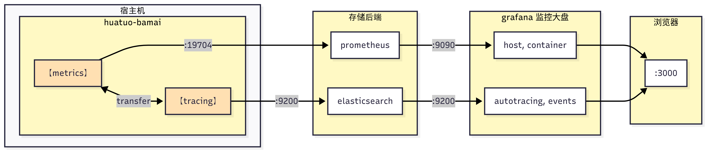

# 快速上手

## 1 极速体验
如果你只关心底层原理，不关心容器信息、存储、前端展示大盘等，我们提供了编译好的镜像，已包含 HUATUO 底层运行的必要组件，直接运行即可：

```bash
$ docker run --privileged --cgroupns=host --network=host -v /sys:/sys -v /run:/run huatuo/huatuo-bamai:latest
```

此运行方式没有其他任何外部依赖，在配置文件里已关闭了容器信息维护和 es 数据存储。

- **获取指标 (Metric)**：在另外一个终端通过 pull 方式获取指标
    ```bash
    $ curl -s localhost:19704/metrics
    ```
- **查看异常事件 (Events, AutoTracing)**：采集到的异常上下文信息会向 es 主动 push 一份（已关闭），在本地路径 `./record` 下对应事件名称的文件里也滚动留存一份，通常该路径下没有任何文件（系统是正常状态不会触发采集），可通过构造异常场景或在配置文件里修改阈值条件使其产生事件。

## 2 快速搭建
如果你想更进一步了解 HUATUO 运行机制、架构设计、监控大盘等，可在本地很方便地搭建 HUATUO 完整运行的所有组件，我们提供容器镜像以及简单配置，方便用户开发者快速了解 HUATUO。



<div style="text-align: center; margin: 8px 0 20px 0; color: #777;">
<small>
HUATUO 组件之 huatuo-bamai 运行示意图<br>
</small>
</div>

为快速搭建运行环境，我们提供一键运行的方式，仓库代码拉下来后在项目根目录下执行，该命令会启动 [elasticsearch](https://www.elastic.co), [prometheus](https://prometheus.io), [grafana](https://grafana.com) 以及 huatuo-bamai 组件。命令执行成功后，打开浏览器访问 [http://localhost:3000](http://localhost:3000) 即可浏览监控大盘（grafana 默认管理员账户：admin 密码：admin； 你的系统处于正常状态，Events, AutoTracing 大盘里通常没有数据）。

```bash
$ docker compose --project-directory ./build/docker up
```

如下日志表示所有组件正常运行：
```
...
huatuo-bamai  | Elasticsearch is ready.
...
huatuo-bamai  | time="2025-08-08T15:09:25.655648688Z" level="info" msg="The prometheus Metrics HTTP server is startting: &{0x19646e0 Exceeded configured timeout of 30s.\n 30000000000 <nil>}" file="collector.go:48" func="huatuo-bamai/internal/services.CollectorDo.func1"
huatuo-bamai  | [GIN] 2025/08/08 - 15:09:25 | 200 |   12.811444ms |             ::1 | GET      "/metrics"
huatuo-bamai  | [GIN] 2025/08/08 - 15:09:40 | 200 |   12.032959ms |             ::1 | GET      "/metrics"
huatuo-bamai  | [GIN] 2025/08/08 - 15:09:55 | 200 |   17.215616ms |             ::1 | GET      "/metrics"
...
```

### 2.1 容器信息配置
如果你的机器通过 kubelet 管理容器，在配置文件里对应修改向 kubelet 获取容器信息的 url, ca path 字段，这样除监控宿主外还可监控本机所有容器的指标和异常行为，获取指标和查看异常事件方式与前面完全一致。
```yml
  # Pod Configurations, pods info from kubelet.
  [Pod]
    KubeletPodListURL = "http://127.0.0.1:10255/pods"
    KubeletPodListHTTPSURL = "https://127.0.0.1:10250/pods"
    KubeletPodCACertPath = "/etc/kubernetes/ca.pem"
    KubeletPodClientCertPath = "/var/lib/kubelet/pki/kubelet-client-current.pem"
```

### 2.2 存储配置
- **指标存储 (Metric)**

    使用 pull 方式提供 prometheus 格式的宿主和容器纬度的 Metrics 数据，完全兼容将 Metrics 数据保存于支持 prometheus 的存储后端。为方便入门，快速搭建这里使用 prometheus 容器完成该工作。采集端口和 path 可对应在配置文件修改，默认 port 19704， path `/metrics`。

- **异常事件存储 (Events, AutoTracing)**

    异常发生时使用 push 方式向 elasticsearch 提交包含有容器信息、异常进程、中断上下文等重要数据，同时在本地也滚动保存一份供根因分析。为方便入门，快速搭建这里使用 elasticsearch 容器完成异常事件远端存储工作，可根据你的环境对应修改。

    elasticsearch 配置如下：
    ```yaml
    # disable ES storage if one of Address, Username, Password empty.
    [Storage.ES]
        Address = "http://127.0.0.1:9200"
        Username = "elastic"
        Password = "huatuo-bamai"
        Index = "huatuo_bamai"
    ```

    本地存储配置如下：
    ```yaml
    # tracer's record data
    # Path: all but the last element of path for per tracer
    # RotationSize: the maximum size in Megabytes of a record file before it gets rotated for per subsystem
    # MaxRotation: the maximum number of old log files to retain for per subsystem
    [Storage.LocalFile]
        Path = "./record"
        RotationSize = 100
        MaxRotation = 10
    ```

### 2.3 异常事件触发阈值、条件配置
异常采集 Events 和 AutoTracing 对应的阈值、条件在 huatuo-bamai.conf 配置文件中默认已经设置，这些配置都是在实际生产环境中反复验证后的经验数据，当然也可自行可独立设置。

## 3 大盘预览
如果你不想敲键盘，我们也提供了大盘预览方式，可进行查询交互，如查看异常事件上下文信息、Metrics 曲线等：

- [Events, AutoTracing 大盘（待完善）](http://console.huatuo.tech/public-dashboards/0e4a67cd787a476d93e634b8a6b77b9d)
- [Metrics 宿主机大盘（待补充）]()
- [Metrics 宿主机大盘（待补充）]()

如果你打算添加自己的 Metric, Events, AutoTracing 或者觉得我们提供的大盘不够完善，你可以按照前面的介绍自行搭建环境然后再对大盘进行个性化配置即可。