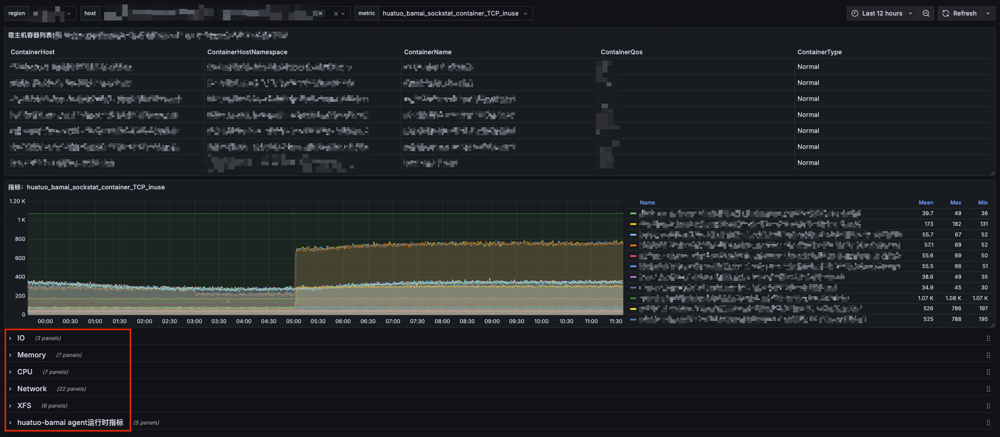
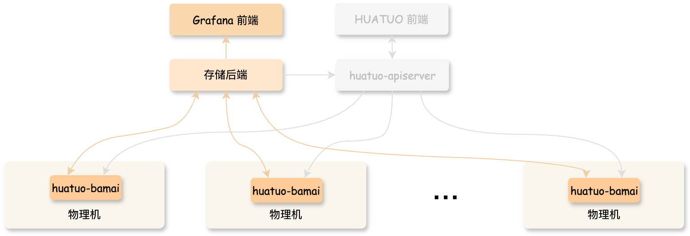
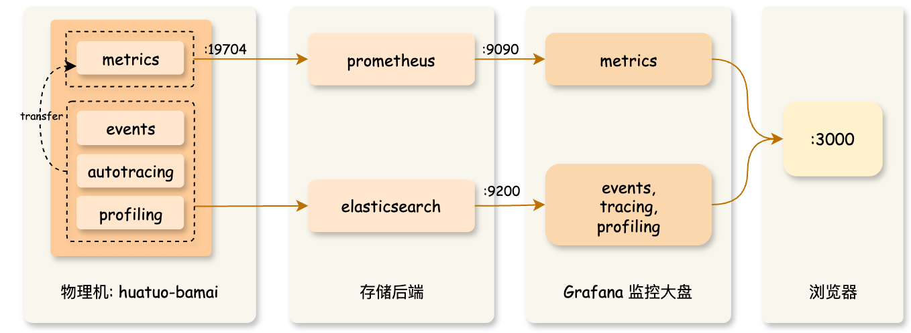

简体中文 | [English](./quick-start.md)

---
> 为帮助大家快速体验、部署 HUATUO, 该文档分别从 [极速体验](#1-极速体验)，[快速开始](#2-快速开始)，[编译部署](#3-编译部署) 三部分说明。

---

## 1 极速体验

该部分可以帮助你快速了解前端效果。你可以直接在前端大盘进行一些查询操作，如查看异常事件概览、异常事件上下文信息、指标曲线等，免登陆访问大盘示例：

- [Events, AutoTracing 大盘（完善中）](http://console.huatuo.tech/public-dashboards/a6342b13a1ee4feaba0ebd0876ac6b70)
  
  示例中，跳转火焰图页面需登录，账户：huatuo 密码：huatuo1024

- [宿主机 Metrics 大盘（完善中）](http://console.huatuo.tech/public-dashboards/418491ef0af5491ea5ea8562494291be)
  

- [容器 Metrics 大盘（完善中）](http://console.huatuo.tech/public-dashboards/3ecd5127881044e885d3e5ca16ce518a)
 

## 2 快速开始



### 2.1 快速运行 
如果你想了解底层原理，将 HUATUO 部署到自己的监控系统。你可以通过 docker 启动已经编译好的容器镜像（注意：该方式默认关闭了获取容器信息功能，和 ES 存储功能）。

- **直接运行**：
    ```bash
    $ docker run --privileged --cgroupns=host --network=host -v /sys:/sys -v /proc:/proc -v /run:/run huatuo/huatuo-bamai:latest
    ```

- **获取指标**：在另外一个终端获取指标
    ```bash
    $ curl -s localhost:19704/metrics
    ```
- **查看异常事件 (Events, AutoTracing)**：HUATUO 会将采集到的内核异常事件信息在 ES 存储一份（已关闭），同时在本地目录 `./record` 留存一份。注意：通常该路径下没有任何文件（正常状态的系统不会触发事件采集），你可以通过构造异常场景或者修改配置文件阈值产生事件。

### 2.2 快速搭建
如果你想更进一步了解 HUATUO 运行机制、架构设计、监控大盘、自定义部署等。通过 docker compose，可以快速地在本地搭建部署一套完整的环境。

```bash
$ docker compose --project-directory ./build/docker up
```

该命令拉取最新镜像，同时启动 [elasticsearch](https://www.elastic.co), [prometheus](https://prometheus.io), [grafana](https://grafana.com)，huatuo-bamai 等组件。命令执行成功后，打开浏览器访问 [http://localhost:3000](http://localhost:3000) 即可浏览监控大盘（grafana 默认管理员账户：admin 密码：admin； 由于你的系统处于正常状态，Events, AutoTracing 大盘里通常没有数据）。




## 3 编译部署
### 3.1 编译
为隔离开发者本地环境和简化编译流程，我们提供容器化编译方式，你可以直接通过 docker build，构建完成的镜像（包含底层采集器 huatuo-bamai、bpf obj、工具等）。在项目根目录运行：

```bash
$ docker build --network host -t huatuo/huatuo-bamai:latest .
```

### 3.2 运行
- 运行容器：
    ```bash
    $ docker run --privileged --cgroupns=host --network=host -v /sys:/sys -v /proc:/proc -v /run:/run huatuo/huatuo-bamai:latest
    ```

- 或从容器 `/home/huatuo-bamai` 路径下拷贝出所有文件后本地手动运行：
    ```bash
    $ ./huatuo-bamai --region example --config huatuo-bamai.conf
    ```
- 托管：可使用 systemd/supervisord/k8s-DaemonSet 等方式托管运行。

### 3.3 配置
- #### 配置容器信息
    HUATUO 通过调用 kubelet 接口获取POD/容器信息。你可以根据实际环境配置访问接口和证书，配置为空“”，表示禁用该功能。
    ```yml
      [Pod]
        KubeletPodListURL = "http://127.0.0.1:10255/pods"
        KubeletPodListHTTPSURL = "https://127.0.0.1:10250/pods"
        KubeletPodClientCertPath = "/var/lib/kubelet/pki/kubelet-client-current.pem"
    ```

- #### 配置存储
    - **指标存储 (Metric)**: 所有的指标都存储在 prometheus，你可以通过访问 :19704/metrics 接口获取指标。 
    - **异常事件存储 (Events, AutoTracing)**: 所有的内核事件，和 Autotracing 事件都存储在 ES。注意：如果配置为空表示不启动 ES 存储，只在本地目录 `./record` 存储事件。

        ES 存储配置如下：
        ```yaml
        [Storage.ES]
            Address = "http://127.0.0.1:9200"
            Username = "elastic"
            Password = "huatuo-bamai"
            Index = "huatuo_bamai"
        ```

        本地存储配置如下：
        ```yaml
        # tracer's record data
        # Path: all but the last element of path for per tracer
        # RotationSize: the maximum size in Megabytes of a record file before it gets rotated for per subsystem
        # MaxRotation: the maximum number of old log files to retain for per subsystem
        [Storage.LocalFile]
            Path = "./record"
            RotationSize = 100
            MaxRotation = 10
        ```

- #### 事件阈值
    所有的内核事件采集 Events 和 AutoTracing 都可以配置触发阈值。默认的阈值都是在实际生产环境反复验证后的经验数据，你可以根据自身需求，在 huatuo-bamai.conf 中修改阈值。

- #### 资源限制
    为保障物理机稳定性，我们对采集器进行了资源限制，其中 LimitInitCPU 表示采集器启动阶段占用的 CPU 资源，LimitCPU/LimitMem 表示采集器启动成功后常态占用的资源限制：
    ```yaml
    [RuntimeCgroup]
        LimitInitCPU = 0.5
        LimitCPU = 2.0
        # limit memory (MB)
        LimitMem = 2048
    ```
